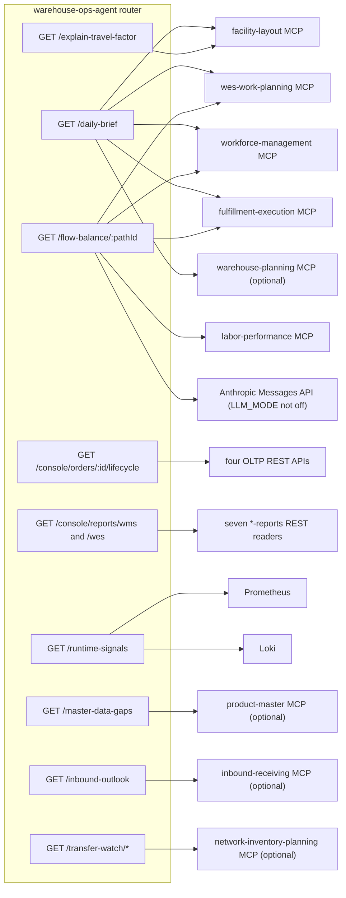

# HTTP routes

This page lists every route that `internal/adapters/inbound/http/router.go`
registers (lines 114–134). The repo has no `apis/openapi.yaml`, so no API
reference is generated. This page and the shorter
[API surface](../api-surface.md) summary are the only description of the
REST contract. If they disagree with the router, the router is correct.

## Conventions shared by every route

| Topic | Behaviour (source) |
|---|---|
| Listener | One `net/http` server on `AGENT_ADDR` (default `:8095`) serves every REST route and the MCP endpoint (`cmd/agent/main.go`, `serveAgent`). In the Helm chart the Service listens on port 80 and forwards to the container's `http` port 8095. |
| Edge | warehouse-infra exposes the agent through Kong at `http://localhost:8000/api/warehouse-ops-agent`. Kong strips the prefix (`konghq.com/strip-path: "true"`, warehouse-infra `terraform/ops-agent.tf`), so `/api/warehouse-ops-agent/daily-brief` reaches the router as `/daily-brief`. |
| Methods | Every REST route is `GET`. `/mcp` accepts every method (chi `Handle`), because Streamable HTTP uses `POST` for messages and `GET` for the event stream. |
| Authentication | None. REST and MCP are unauthenticated fleet-wide ([ADR 0006](../adr/0006-fleet-wide-auth-removal.md)). |
| CORS | `go-chi/cors`. Allowed origins come from `CORS_ALLOWED_ORIGINS` (comma-separated, default `http://localhost:5173`). Allowed methods `GET` and `OPTIONS`. Allowed headers `Content-Type` and `Authorization`. No credentials, preflight cached for 300 s (`corsMiddleware`). |
| Middleware order | `middleware.RequestID`, `otelchi.Middleware` (one server span per request, named after the chi route pattern), `otelchimetric.NewServerRequestDuration`, `otelchimetric.NewServerActiveRequests`, `RequestLogger`, `middleware.Recoverer`, CORS. `/mcp` goes through the same chain ([ADR 0010](../adr/0010-standard-metrics-convention.md)). |
| Body | JSON with `Content-Type: application/json` (`writeJSON`). |
| Errors | A flat `{"error": "<message>"}` object. It is not an RFC 7807 problem document, and there is no `type` slug to match on. |
| Optional capabilities | A route whose use case is not wired returns `503` with an `error` message instead of panicking. Five routes depend on an optional upstream: `/master-data-gaps` (product-master), `/inbound-outlook` (inbound-receiving) and the three `/transfer-watch/*` routes (network-inventory-planning). |
| Upstream failures | Most use cases degrade instead of failing: a missing signal becomes `null`, an `unavailable` entry or a conservative `hold`. A `502` is returned only where the code says so (see each route). |

## Route index

| Method and path | Use case | Upstream calls | Statuses |
|---|---|---|---|
| `GET /healthz` | none | none | 200 |
| `GET /daily-brief` | `DailyBrief` (E3) | facility-layout, wes-work-planning, workforce-management, fulfillment-execution over MCP; warehouse-planning when configured | 200 |
| `GET /flow-balance/{pathId}` | `FlowBalanceAdvisory` (E1) | wes-work-planning, workforce-management, fulfillment-execution, labor-performance over MCP; Anthropic when `LLM_MODE` is not `off` | 200, 400 |
| `GET /explain-travel-factor` | `ExplainTravelFactor` | facility-layout over MCP | 200, 400, 502 |
| `GET /console/orders/{id}/lifecycle` | `OrderLifecycle` (console-bff) | order-management, inventory-storage, wes-work-planning, fulfillment-execution over REST | 200, 404, 500 |
| `GET /console/reports/wms` | `ConsoleReports.ExecuteWMS` | order-management, inventory-storage and facility-layout `*-reports` readers over REST | 200, 400 |
| `GET /console/reports/wes` | `ConsoleReports.ExecuteWES` | wes-work-planning, fulfillment-execution, workforce-management and labor-performance `*-reports` readers over REST | 200, 400 |
| `GET /runtime-signals` | `RuntimeSignals` | Prometheus HTTP API, Loki `query_range` | 200 |
| `GET /master-data-gaps` | `MasterDataGaps` | product-master over MCP | 200, 400, 502, 503 |
| `GET /inbound-outlook` | `InboundOutlook` | inbound-receiving over MCP | 200, 502, 503 |
| `GET /transfer-watch/stuck` | `TransferWatch.StuckTransfers` | network-inventory-planning over MCP | 200, 400, 502, 503 |
| `GET /transfer-watch/transfers/{id}` | `TransferWatch.TransferStatus` | network-inventory-planning over MCP | 200, 400, 404, 502, 503 |
| `GET /transfer-watch/imbalance` | `TransferWatch.NetworkImbalance` | network-inventory-planning over MCP | 200, 400, 502, 503 |
| `/mcp` (any method) | this agent's own MCP server | see [MCP tools](../mcp/tools.md) | MCP protocol |

`Recoverer` turns a panic into a `500` on any route.



Source: `internal/adapters/inbound/http/router.go`, `cmd/agent/main.go`.

## Health — `GET /healthz`

No parameters. Always `200` with `{"status": "ok"}` once the server is
listening (`healthz`, router.go). It checks no upstream. The chart uses it
for both the liveness and the readiness probe. There is no `/readyz` route.

## Daily brief — `GET /daily-brief`

**Parameters:** none. The monitored paths come from
`DAILY_BRIEF_PATH_TARGETS` (see [Configuration](../operations/configuration.md)).

**Fan-out** (`usecases.DailyBrief.Execute`, sequential, per target):

| Order | Upstream tool | Arguments | Used for |
|---|---|---|---|
| once | facility-layout `list_sites` | none | site names (`siteName`); a failure leaves `siteName` empty |
| per path | wes-work-planning `get_backlog_telemetry` | `pathId` | `backlog` |
| per path | workforce-management `get_staffing_gap` | `buildingId`, `shiftId`, `pathId` | `staffing` |
| per path | fulfillment-execution `get_queue_status` | `processPath` | `queue` |
| per path | fulfillment-execution `diagnose_stuck_tasks` | `withinSeconds = 0` (already-expired leases only) | `stuck`, filtered to tasks whose type equals the path's `processPath` |
| per path, optional | warehouse-planning `get_process_path_capacity` | `pathId = planningPathId`, `location = siteCode`, window `[now, now + CAPACITY_OUTLOOK_HORIZON)`, `unitsPerOrder` and `packagesPerOrder` when set | `capacityOutlook` |

**Status:** always `200`. A failed call adds an entry such as
`"wes-work-planning: <error>"` to that path's `unavailable` list and leaves
the fact out. A client whose endpoint is unset fails the same way at call
time. It does not skip the path.

**Response:**

```json
{
  "generatedAt": "2026-10-09T12:00:00Z",
  "sites": [
    {
      "siteCode": "WH1",
      "siteName": "Warehouse 1",
      "paths": [
        {
          "pathId": "pick-zone-a",
          "processPath": "PICK",
          "backlog": {"backlogDepth": 120, "wip": 8, "overAlarmThreshold": true},
          "staffing": {"plannedHeads": 6, "activeHeads": 4, "understaffed": true},
          "queue": {"depth": 40},
          "stuck": {"count": 0},
          "unavailable": ["..."],
          "exceptions": [],
          "capacityOutlook": {"...": "only when WAREHOUSE_PLANNING_MCP_ENDPOINT is set"}
        }
      ]
    }
  ],
  "openExceptions": [
    {
      "kind": "flow_balance_risk",
      "siteCode": "WH1",
      "pathId": "pick-zone-a",
      "severity": "warning",
      "summary": "2 independent flow-imbalance signal(s) correlated for path pick-zone-a",
      "evidence": ["wes-work-planning get_backlog_telemetry: over alarm threshold (backlogDepth=120, wip=8)", "..."]
    }
  ]
}
```

`backlog`, `staffing`, `queue`, `stuck`, `unavailable`, `exceptions` and
`capacityOutlook` are omitted when empty. The exception rule
(`policy.deriveExceptions`) counts three signals: backlog over its alarm
threshold, the path understaffed, and more than zero stuck tasks. Two
signals give a `warning` and three give a `critical`. Queue depth is
reported but is not one of the signals. `openExceptions` lists every
path's exceptions with `critical` first.

`capacityOutlook` ([ADR 0013](../adr/0013-warehouse-planning-mcp-client-and-capacity-outlook.md))
has `planningPathId`, `windowStart`, `windowEnd`, and either
`omittedReason` alone or `normalizedRate` (orders per hour),
`bottleneckStep`, `bindingConstraint`, `steps[]` (`step`, `normalizedRate`,
`bindingConstraint`) and `warnings[]`.

## Flow-balance exception — `GET /flow-balance/{pathId}`

**Parameters:** path `pathId` (wes-work-planning path id); query
`buildingId` and `shiftId`. The handler does not check that the two query
parameters are present. It passes empty strings to workforce-management,
and if that call fails the staffing signal is treated as missing.

**Fan-out** (`usecases.FlowBalanceAdvisory.Execute`):

| Upstream tool | Arguments |
|---|---|
| wes-work-planning `get_rebalance_recommendation` | `pathId` |
| workforce-management `get_staffing_gap` | `buildingId`, `shiftId`, `pathId` |
| fulfillment-execution `diagnose_stuck_tasks` | `withinSeconds = 900` (the 15-minute `defaultStuckTaskWindow`) |
| labor-performance `get_task_type_utilization` | the task type bound to `pathId` through the `processPath` of a `DAILY_BRIEF_PATH_TARGETS` entry; called only when the wes signal arrived and the path is bound |
| Anthropic Messages API | only when `LLM_MODE` is `shadow` or `on` ([ADR 0004](../adr/0004-llm-reasoner-behind-the-policy-layer.md)) |

**Response (`200`):**

| Field | Meaning |
|---|---|
| `pathId` | echoed |
| `recommendedAction` | `assign_labor`, `release_next_work` or `hold` |
| `proposedHeads` | only for `assign_labor`: planned minus active heads, at least 1 |
| `rationale` | the sentence that explains the decision |
| `partial` | `true` when a signal the decision needed was missing |
| `missingSignals` | e.g. `workforce-management.get_staffing_gap` |
| `evidence[]` | `{source, detail}` per signal that arrived, including the labor-performance reading |
| `utilization` | `{kind, rationale}` with `kind` one of `claim_flow_problem`, `starvation`, `staffing_gap_confirmed` ([ADR 0008](../adr/0008-labor-utilization-advisory-correlation.md)); omitted when there is no correlation |
| `source` | `deterministic`, `llm` or `fallback` |

**Errors:** `400` when wes-work-planning answers with a rebalance action
outside `NoActionNeeded`, `ThrottleUpstream` and `ReassignLabor`. The
message starts with `flow_balance_advisory:`. This is the only error the
use case returns. An unavailable upstream never fails the request.

## Explain travel factor — `GET /explain-travel-factor`

**Parameters:** query `fromLocationCode` and `toLocationCode` (required,
seven-segment facility-layout codes such as `WH1-STOR-AMB-A07-01-01-A`) and
`pathId` (only logged).

**Fan-out:** facility-layout `estimate_travel_distance` with the two codes.

**Response (`200`):** `metresM`, `estimated`, `kind`
(`travel_significant` when the distance is above 60 m, otherwise
`travel_negligible`) and `rationale`.

**Errors** ([ADR 0016](../adr/0016-rest-error-mapping-cors-and-strict-path-target-config.md),
[ADR 0018](../adr/0018-mcp-tool-error-slug-classification.md)):

| Status | When |
|---|---|
| `400` | a location code is missing, or facility-layout rejects the call with a validation slug (`malformed-*`, `invalid-*`, `*-required`, `validation-failed`, `missing-location-code`) |
| `502` | facility-layout is unreachable or rejects the call with any other slug, or with text that has no slug |

## Order lifecycle — `GET /console/orders/{id}/lifecycle`

The console-bff view behind warehouse-console's Order Lifecycle screen
([ADR 0002](../adr/0002-micro-frontend-console-architecture.md)).

**Parameters:** path `id`, the order id.

**Fan-out** (`usecases.OrderLifecycle.Execute`, sequential, 5 s HTTP
timeout per call, `internal/adapters/outbound/restclient/clients.go`):

| Order | Request | Base URL variable |
|---|---|---|
| 1 | `GET /orders/<id>` | `ORDER_MANAGEMENT_REST_URL` |
| 2 | `GET /reservations?demandRef=<id>` | `INVENTORY_STORAGE_REST_URL` |
| 3 | `GET /work-units?reference=<id>` | `WES_WORK_PLANNING_REST_URL` |
| 4 | `GET /tasks?orderRef=<workUnitId>` once per work unit from step 3 | `FULFILLMENT_EXECUTION_REST_URL` |

**Response (`200`):** `orderId` plus four stages. A stage is `null` when
its context did not answer:

- `orderManagement`: `status`, `allowPartialShipment`, `promiseDate`,
  `lines[]` (`lineNo`, `sku`, `quantity`, `status`) and `receivedAt`.
- `inventory`: `reservations[]` (`sku`, `quantity`, `status`).
- `planning`: `workUnits[]` (`workUnitId`, `pathId`, `status`, `fragile`,
  `giftWrap`).
- `fulfillment`: `tasks[]` (`taskId`, `taskType`, `status`, `stationId`,
  `weightDiscrepancy`, `leaseExpiredCount`), `packageSealed` and
  `labelApplied`.

Some fields are fixed by the mapper in `toOrderLifecycleDTO`:
`receivedAt` is always `null`, `fragile` is always `false`,
`weightDiscrepancy` is always `false` and `leaseExpiredCount` is always
`0`. `packageSealed` and `labelApplied` are both `true` exactly when a
`SLAM` task has status `COMPLETED`.

**Errors:** `404 {"error": "order not found"}` when order-management
answers 404. Any other order-management failure leaves `orderManagement`
`null` in a `200`. `500 {"error": "internal error"}` is defensive only: the
use case returns no other error today.

## WMS and WES dashboards — `GET /console/reports/wms`, `GET /console/reports/wes`

The console-bff dashboards ([ADR 0003](../adr/0003-console-bff-report-dashboards.md)).

**Parameters:** query `from` and `to`, both optional RFC3339 timestamps.
With neither, the window is the last 24 hours. With only `to`, `from` is
24 hours before it. With only `from`, `to` is now.

**Fan-out:** every section runs concurrently (`ConsoleReports.runSections`)
with a 5 s HTTP timeout. Each section makes two calls to that context's
`*-reports` reader: `GET <path>?from=<UTC RFC3339>&to=<UTC RFC3339>` and
`GET <path>/freshness`, which answers `{"lagSeconds": <float>}`.

| Dashboard | Section `id` | `title` | `chartKind` | Reader path | Base URL variable | Series |
|---|---|---|---|---|---|---|
| wms | `order-funnel` | Order Funnel | `funnel` | `/reports/funnel` | `ORDER_MANAGEMENT_REPORTS_REST_URL` | Received, Allocated (includes partial allocations), Released, Cancelled / Failed |
| wms | `inventory-flow-accuracy` | Inventory Flow Accuracy | `bar` | `/reports/flow-accuracy` | `INVENTORY_STORAGE_REPORTS_REST_URL` | Stowed, Picked, Discrepancies, Unlocated |
| wms | `catalog-growth` | Catalog Growth | `line` | `/reports/catalog-growth` | `FACILITY_LAYOUT_REPORTS_REST_URL` | slots registered per `dayBucket` |
| wes | `planning-throughput` | Planning Throughput | `line` | `/reports/throughput` | `WES_WORK_PLANNING_REPORTS_REST_URL` | work units completed per `hourBucket` |
| wes | `fulfillment-throughput` | Fulfillment Throughput | `bar` | `/reports/throughput` | `FULFILLMENT_EXECUTION_REPORTS_REST_URL` | completions per task type, sorted by name |
| wes | `labor-management` | Workforce Labor | `bar` | `/reports/labor` | `WORKFORCE_MANAGEMENT_REPORTS_REST_URL` | Shifts Started, Labor Assigned, Understaffing Events |
| wes | `labor-performance` | Labor Performance (Efficiency %) | `bar` | `/reports/performance` | `LABOR_PERFORMANCE_REPORTS_REST_URL` | mean efficiency per task type; a task type whose mean is `null` is left out |

**Response (`200`):**

```json
{
  "from": "2026-10-08T12:00:00Z",
  "to": "2026-10-09T12:00:00Z",
  "generatedAt": "2026-10-09T12:00:00Z",
  "sections": [
    {
      "id": "order-funnel",
      "title": "Order Funnel",
      "sourceContext": "order-management",
      "chartKind": "funnel",
      "available": true,
      "error": null,
      "freshnessLagSeconds": 4.2,
      "series": [{"label": "Received", "value": 12}]
    }
  ]
}
```

A section whose reader fails has `available: false`,
`error: "<context> reports not available"` and `series: []`. A failed
freshness call leaves `freshnessLagSeconds` `null` and keeps the section
available.

**Errors:** `400` when `from` or `to` is not RFC3339, or when `to` is not
after `from`.

## Runtime signals — `GET /runtime-signals`

**Parameters:** none. The services and the namespace come from
`RUNTIME_SIGNALS_SERVICES` and `RUNTIME_SIGNALS_NAMESPACE`. The window is
fixed at 10 minutes (`newRuntimeSignals`, `cmd/agent/main.go`).

**Fan-out** (`usecases.RuntimeSignals.Execute`):

| Source | Query |
|---|---|
| Loki, once | `GET /loki/api/v1/query_range` with `{namespace="<namespace>"} \|~ "(?i)error\|fatal"` over 600 s, at most 50 lines. Each line is counted for the service in its `app` label, or else its `container` label. |
| Prometheus, per service | `sum(increase(istio_requests_total{destination_service_name="<svc>"}[10m]))`, the same with `response_code=~"5.."`, and `histogram_quantile(0.99, sum by (le) (rate(istio_request_duration_milliseconds_bucket{destination_service_name="<svc>"}[10m])))`, all through `GET /api/v1/query` |

**Response (`200`, always):**

```json
{
  "generatedAt": "2026-10-09T12:00:00Z",
  "services": [
    {
      "serviceName": "order-management",
      "severity": "warning",
      "errorRate": 0.012,
      "errorRateSeverity": "warning",
      "latencyP99Ms": 240,
      "latencyP99Severity": "normal",
      "recentErrorLogs": 3,
      "sampleWindowMins": 10
    }
  ],
  "unavailableSources": ["loki"]
}
```

Severities are `normal`, `warning` or `critical`. The error rate is
`warning` from 1% and `critical` from 5%. The p99 latency is `warning` from
1000 ms and `critical` from 3000 ms. `severity` is the worse of the two,
raised to at least `warning` when `recentErrorLogs` is above 0.
`unavailableSources` lists `loki` when `LOKI_URL` is unset or the query
failed, and `prometheus` when any Prometheus query failed. With
`PROMETHEUS_URL` unset the agent uses a stub reader that returns no
samples, so every metric reads 0 (`normal`) and `prometheus` is not listed.

## Master-data gaps — `GET /master-data-gaps`

[ADR 0020](../adr/0020-product-master-mcp-client-and-master-data-gaps.md).

**Parameters:** query `kind` (optional, `unclassified` or
`dimension-discrepancy`) and `cursor` (optional, the `nextCursor` of an
earlier incomplete scan).

**Fan-out:** product-master `list_products`, 500 products per page, at
most 10 pages (5,000 products) per request. With `kind=unclassified` the
call asks product-master for unclassified products only
(`classified=false`).

**Response (`200`):** `scanned`, `complete`, `nextCursor` (only when
`complete` is `false`), `unclassifiedCount`, `dimensionDiscrepancyCount`
and `gaps[]`. Each gap has `sku`, `description`, `version`, `kinds[]`,
`rationale[]`, and for a dimension discrepancy `declared` and `measured`
(`lengthMm`, `widthMm`, `heightMm`, `weightG`, `volumeMm3`), `measuredAt`
and `deviceId`.

| Status | When |
|---|---|
| `400` | unknown `kind`, or product-master rejects the cursor with a validation slug |
| `502` | product-master is unreachable or a page fails. The report has no partial mode. |
| `503` | `PRODUCT_MASTER_MCP_ENDPOINT` is unset (`{"error": "product-master not configured"}`) |

## Inbound outlook — `GET /inbound-outlook`

[ADR 0021](../adr/0021-inbound-receiving-mcp-client-and-inbound-outlook.md).

**Parameters:** none.

**Fan-out:** inbound-receiving `list_asns` (state `Registered`),
`list_appointments` (from now to now + 24 h), `list_receipts` (state
`Open`, only when `INBOUND_STALE_RECEIPT_AGE` is set) and `list_receipts`
(state `Closed`). Each scan reads at most 10 pages of 500.

**Response (`200`):** `generatedAt`, `appointmentsUntil`, `dayFrom` and
`dayTo` (today in the agent's local time zone), `staleAfterSeconds` (omitted
when the stale age is unset) and four sections: `awaitingAsns`,
`upcomingAppointments`, `staleReceipts` and `discrepantReceipts`. Each
section is `{omitted, complete, count, items[]}`. `omitted` is present
only when the section could not be built, so an omitted section means
"unknown", not "nothing to report". `complete: false` means the
5,000-record bound was reached.

| Section | Item fields |
|---|---|
| `awaitingAsns` | `asnNumber`, `supplierRef`, `expectedArrival`, `state`, `overdue` |
| `upcomingAppointments` | `appointmentId`, `doorCode`, `carrier`, `windowStart`, `windowEnd`, `asnNumbers[]`, `state` (`Booked` or `CheckedIn`) |
| `staleReceipts` | `receiptId`, `asnNumber`, `doorCode`, `openedAt`, `openForSeconds` |
| `discrepantReceipts` | `receiptId`, `asnNumber`, `doorCode`, `openedAt`, `closedAt`, `discrepancies[]` (`lineNo`, `sku`, `kind`, `expectedQty`, `receivedQty`, `damagedQty`) |

| Status | When |
|---|---|
| `502` | every section that was attempted failed |
| `503` | `INBOUND_RECEIVING_MCP_ENDPOINT` is unset (`{"error": "inbound-receiving not configured"}`) |

## Transfer watch — `GET /transfer-watch/*`

[ADR 0019](../adr/0019-network-inventory-planning-transfer-watch.md). All
three routes answer `503` with
`{"error": "transfer watch not configured (network-inventory-planning endpoint unset)"}`
while `NETWORK_INVENTORY_PLANNING_MCP_ENDPOINT` is unset.

### `GET /transfer-watch/stuck`

**Parameters:** query `olderThanMinutes` (required, a positive integer),
`state` (optional, one of the non-terminal states `DRAFT`, `PROPOSED`,
`APPROVED`, `ALLOCATING`, `ALLOCATED`, `PICKED`, `IN_TRANSIT`, `ARRIVED`)
and `limit` (optional, 0 to 200; 0 or absent uses the upstream default).

**Fan-out:** network-inventory-planning `find_stuck_transfers`.

**Response (`200`):** `total` (every match before paging), `transfers[]`
and `causeCount[]` (`cause`, `count`, highest count first). Each transfer
has `id`, `state`, `sku`, `quantity`, `pickedQuantity`, `originSiteId`,
`destinationSiteId`, `reservationId`, `rejectionReason`, `createdAt`,
`updatedAt` and `triage` (`cause`, `summary`, `nextCheck`).

The triage cause comes from the state alone (`policy.TriageTransfer`):
`ALLOCATING` is `inventory-reply-missing`, `ALLOCATED` and `PICKED` are
`floor-work-not-progressing`, `IN_TRANSIT` and `ARRIVED` are
`destination-receipt-missing`, a finished transfer is `none`, and any
other state is `unclassified`.

**Errors:** `400` when `olderThanMinutes` or `limit` is not an integer,
`olderThanMinutes` is not positive, `limit` is outside 0–200, `state` is
unknown or terminal, or the upstream rejects the input with a validation
slug. `502` for any other upstream failure.

### `GET /transfer-watch/transfers/{id}`

**Parameters:** path `id`, the transfer id.

**Fan-out:** network-inventory-planning `get_transfer`.

**Response (`200`):** the transfer fields above, plus `audit[]` (`seq`,
`from`, `to`, `event`, `cause`, `occurredAt`) and `triage`.

**Errors:** `404` when the upstream answers with a `*-not-found` slug,
`400` for a validation slug, `502` otherwise.

### `GET /transfer-watch/imbalance`

**Parameters:** none.

**Fan-out:** network-inventory-planning `simulate_transfer_options`.

**Response (`200`):** `advisory`, `asOf`, `imbalanced`, `summary`,
`nextCheck` and `sites[]` (`site`, `balance` (`short` or `covered`),
`originEnabled`, `destinationEnabled`, `totalDemand`,
`capacityOverWindow`, `capacityHeadroom`, `explanation`).

**Errors:** `502` when the simulation fails. Network-inventory-planning
answers with a tool error until its read models are fresh, and the agent
passes that through instead of returning an empty reading. `400` for a
validation slug.

## MCP endpoint — `/mcp`

`r.Handle("/mcp", ...)` mounts this agent's own MCP server on the same
router (router.go line 134). It uses Streamable HTTP in stateless mode
(`mcp.StreamableHTTPOptions{Stateless: true}`, `server.go`,
[ADR 0012](../adr/0012-horizontal-autoscaling-single-deployment.md)), so
any replica can answer any request. The route is registered only when the
composition root passes an MCP handler, which `cmd/agent` always does. The
tools are listed on [MCP tools](../mcp/tools.md).

## First calls

```bash
BASE=http://localhost:8095                      # or http://localhost:8000/api/warehouse-ops-agent through Kong
curl -s $BASE/healthz
curl -s $BASE/daily-brief | jq '.openExceptions'
curl -s "$BASE/flow-balance/pick-zone-a?buildingId=wh1&shiftId=shift-1" | jq .
curl -s "$BASE/console/reports/wes?from=2026-10-09T00:00:00Z" | jq '.sections[] | {id, available}'
curl -s "$BASE/transfer-watch/stuck?olderThanMinutes=30&limit=20" | jq .
```
