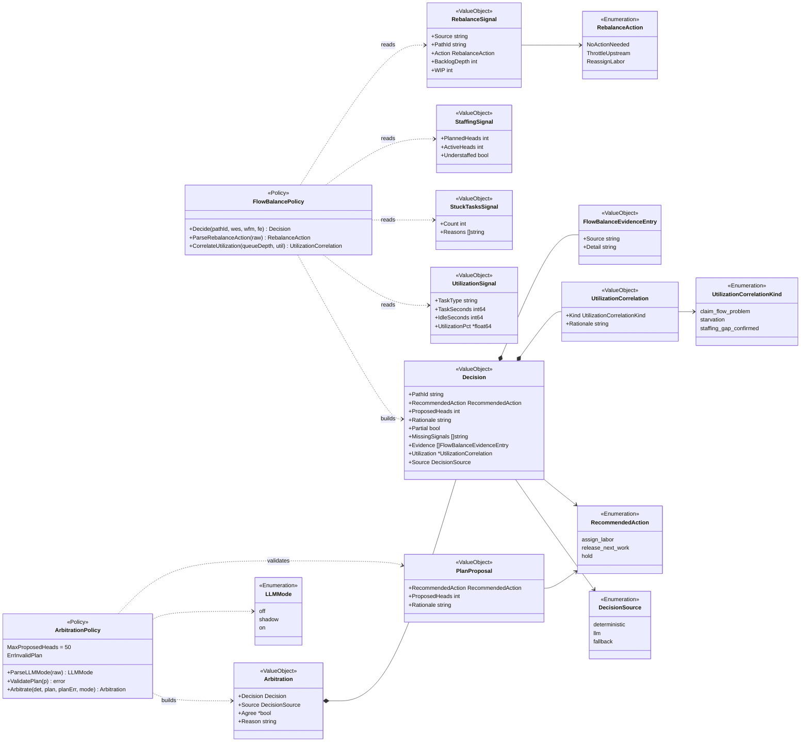
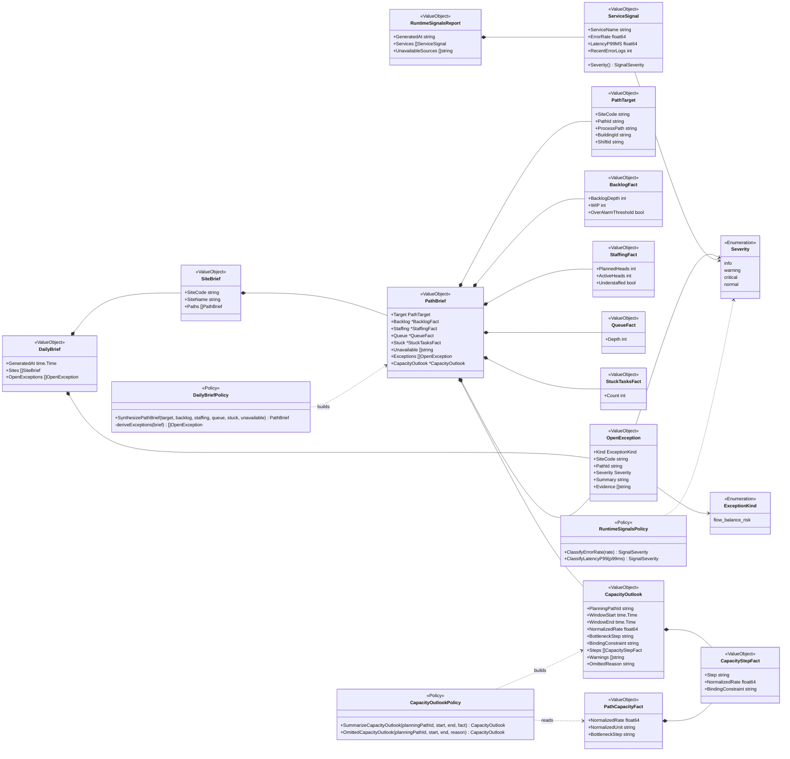
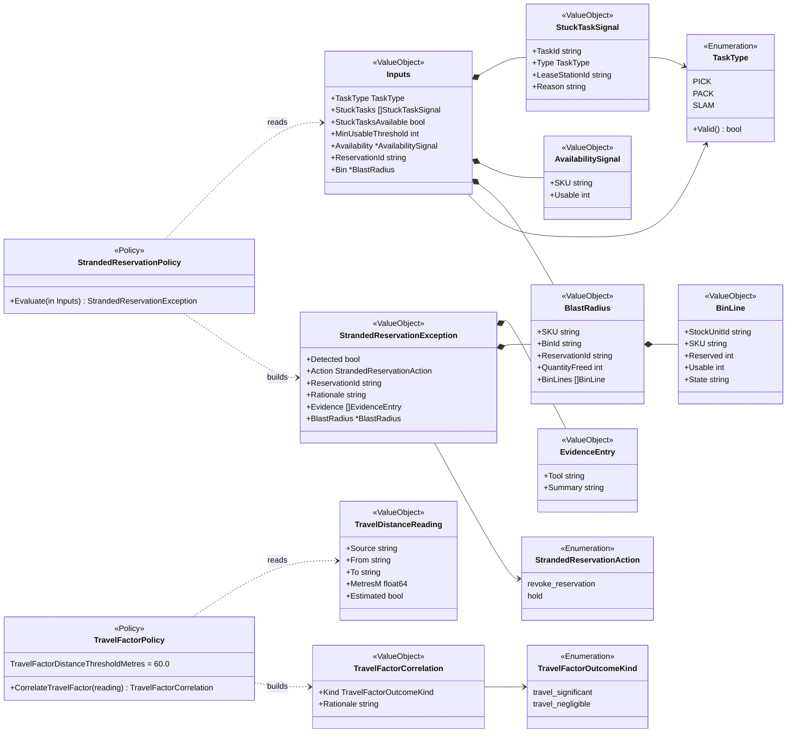
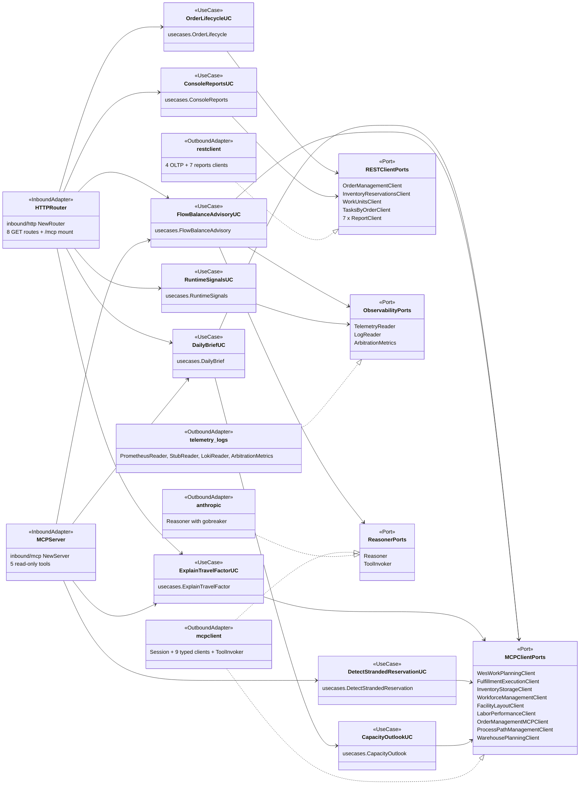

# Class diagram

UML class diagrams (Mermaid `classDiagram`) of `internal/domain/policy`,
split by policy so no diagram exceeds about 25 classes, plus the hexagonal
ports-and-adapters view.

:::note[Stereotypes used]
There is no `<<AggregateRoot>>`, `<<Entity>>`, `<<DomainEvent>>` or
`<<Repository>>` in this codebase (see
[Aggregate design canvas](./aggregate-design-canvas.md)). Policy result
types and their parts are `<<ValueObject>>`; string enums are
`<<Enumeration>>`; the stateless rule functions are grouped into a
`<<Policy>>` box named after their file (Go has no class for them). Ports
are `<<Port>>` interfaces.
:::

## E1 flow balance, ADR 0004 arbitration and ADR 0008 overlay

Source: `internal/domain/policy/flow_balance.go`,
`internal/domain/policy/arbitrate.go`,
`internal/domain/policy/utilization_correlation.go`.
Omits: `Source`/`PathId` fields on `StaffingSignal` and `StuckTasksSignal`,
`Associates`/`WindowSeconds`/`OpenGapSeconds` on `UtilizationSignal`, the
threshold constants (`UtilizationQueueDepthHighThreshold = 50`,
`UtilizationLowPctThreshold = 60.0`,
`UtilizationHighIdleShareThreshold = 0.40`), and unexported helpers.

## E3 daily brief, ADR 0013 capacity outlook and runtime signals

Source: `internal/domain/policy/dailybrief.go`,
`internal/domain/policy/capacity_outlook.go`,
`internal/domain/policy/runtime_signals.go`.
Omits: `ServiceSignal.ErrorRateSev` / `LatencyP99Sev` / `SampleWindowMins`,
`PathCapacityFact.Steps` / `Warnings`, the threshold constants
(`ErrorRateWarningThreshold = 0.01`, `ErrorRateCriticalThreshold = 0.05`,
`LatencyP99WarningMS = 1000`, `LatencyP99CriticalMS = 3000`). `normal` is
the `SeverityNormal` constant of the alias `SignalSeverity = Severity`.

## E2 stranded reservation and ADR 0009 travel factor

Source: `internal/domain/policy/stranded_reservation.go`,
`internal/domain/policy/travel_factor.go`.
Omits: unexported helpers (`stuckByType`, `holdException`,
`revokeException`, `addEvidence`).

## Hexagonal ports and adapters

Source: `internal/adapters/inbound/http/router.go`,
`internal/adapters/inbound/mcp/{server,tools}.go`,
`internal/application/usecases/*.go`, `internal/ports/*.go`,
`internal/adapters/outbound/**`, `cmd/agent/main.go`.
Omits: the `ToolInvoker` lives in `mcpclient` but implements the
`ports.ToolInvoker` half of `ReasonerPorts` only (the anthropic adapter
implements `Reasoner`); `cmd/agent` (the only package that wires layers);
`internal/config`, `internal/observability`, `internal/resilience`. Every
use case also depends on `internal/domain/policy` (not drawn).
