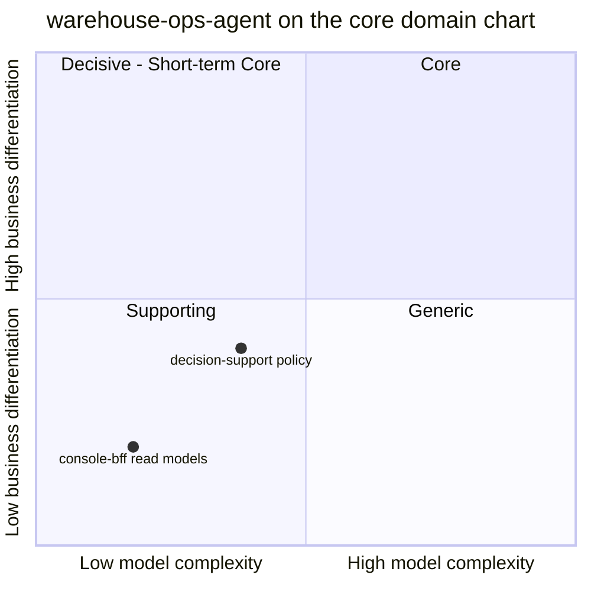

# Core domain chart

Following the ddd-crew
[Core Domain Charts](https://github.com/ddd-crew/core-domain-charts):
business differentiation on the y-axis, model complexity on the x-axis.

Source: `internal/domain/policy/*.go`, `internal/application/usecases/*.go`,
`docs/docs/ddd/subdomain-classification.md`, ADR 0001.
Omits: the neighbouring contexts (each plots itself on its own chart) and
any time dimension.

## Classification: Supporting, with a caveat

The repo's own [Subdomain classification](./subdomain-classification.md)
page declines to classify `warehouse-ops-agent` as a bounded context at
all, because it owns no aggregate. The fleet-wide map still has to put
every repo in one bucket for comparison, and it files this agent as
**Supporting**. Both points above therefore sit in the bottom-left
Supporting quadrant:

- **decision-support policy** (the daily brief, E1 flow balance, E2
  stranded reservation, the ADR 0008 / 0009 overlays, runtime-signal
  classification, the ADR 0004 LLM arbitration) — the more interesting half,
  but still below the midline on both axes.
- **console-bff read models** (`OrderLifecycle`, `ConsoleReports`) — pure
  fan-out and projection with no policy on top, so lower on both axes.

## Evidence for the position

| Axis | Evidence | Reading |
|---|---|---|
| Model complexity | 0 aggregate roots, 0 repositories, 0 migrations, 0 persisted tables, 0 domain events. The policy layer is about 1,460 lines (comments included) of pure functions and value types across the 9 non-test files of `internal/domain/policy` (`Decide`, `Evaluate`, `SynthesizePathBrief`, `Arbitrate`/`ValidatePlan`, `CorrelateUtilization`, `CorrelateTravelFactor`, `SummarizeCapacityOutlook`, `ClassifyErrorRate`/`ClassifyLatencyP99`). | Low to moderate: branching decision tables, no lifecycle or consistency boundary. |
| Business differentiation | It correlates facts other contexts own and only *recommends*; it can execute nothing (zero write tools, CI-enforced by `internal/architecture/zerowrite`). Its value is operator time saved, not a capability the warehouse sells. | Below the midline: useful operator tooling, not the differentiator. |

The thing that would move it right and up is an act slice (write tools
behind an authorization gate and human confirmation, see the
[Governance note](../mcp/governance-note.md)) — and [ADR 0001](../adr/0001-warehouse-ops-agent-placement.md)
says that if a slice ever needs an aggregate, an invariant or persisted
state, it belongs in a different repo.

## Evolution note

Wardley-style evolution: **custom-built**. The correlation rules are
fleet-specific (they bind wes, workforce-management, fulfillment-execution,
inventory-storage, labor-performance and facility-layout vocabulary that
no off-the-shelf WMS exposes in this shape). The console-bff fan-out is
closer to **product**: a standard Backend-for-Frontend shape. The runtime
signals classifier sits on **commodity** inputs (Prometheus, Loki, Istio
metrics). The LLM reasoner (ADR 0004) uses a commodity model API behind a
custom policy gate. Nothing here is in **genesis**.
