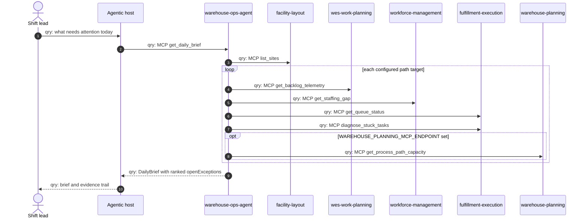
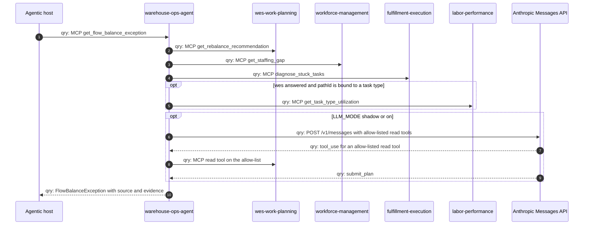
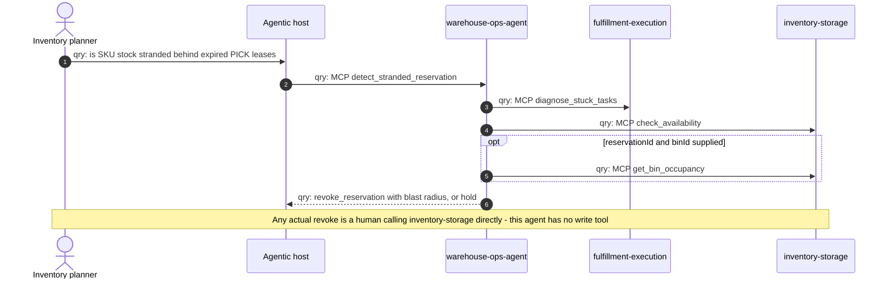
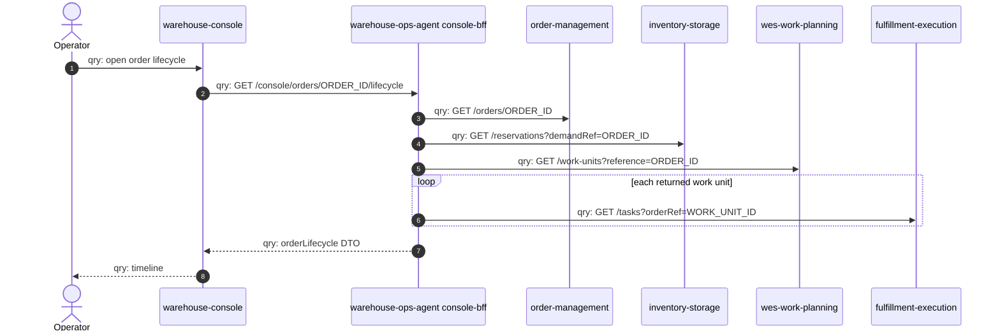

# Domain message flow

Following the ddd-crew
[Domain Message Flow Modelling](https://github.com/ddd-crew/domain-message-flow-modelling)
notation: every arrow is prefixed `cmd:` (command), `evt:` (event) or
`qry:` (query) and numbered.

:::note[Only queries]
Every message in this service's flows is a `qry:`. It issues no command to
any context (zero write tools, CI-enforced) and publishes or consumes no
event (no Kafka I/O). Where a human would act on a recommendation, that
step happens outside this service and is shown as a note, not an arrow.
:::

## 1. Morning brief for a shift lead

An agentic host asks for the daily brief; the agent fans out per
configured path target and returns open exceptions ranked critical-first.

Source: `internal/application/usecases/dailybrief.go`,
`internal/application/usecases/capacity_outlook.go`,
`internal/adapters/inbound/mcp/tools.go`.
Omits: `list_open_exceptions` (same fan-out, filtered by severity) and the
REST twin `GET /daily-brief`.

## 2. Flow-balance exception with the LLM reasoner in shadow mode

Source: `internal/application/usecases/flow_balance_advisory.go`,
`internal/domain/policy/arbitrate.go`,
`internal/adapters/outbound/llm/anthropic/reasoner.go`,
`internal/config/config.go` (default `LLM_TOOL_ALLOWLIST`).
Omits: retries and the circuit breaker on the Anthropic call (ADR 0011),
and that an allow-listed tool may target wes, workforce-management or
fulfillment-execution (only one is drawn).

## 3. Stranded reservation triage

Source: `internal/application/usecases/stranded_reservation.go`,
`internal/domain/policy/stranded_reservation.go`,
`internal/adapters/inbound/mcp/tools.go`.
Omits: the degrade branches (each yields `hold`), detailed on the
[sequence diagrams](./sequence-diagrams.md) page.

## 4. Order lifecycle in the console

Source: `internal/application/usecases/order_lifecycle.go`,
`internal/adapters/outbound/restclient/clients.go`,
`internal/adapters/inbound/http/router.go`.
Omits: the WMS / WES dashboard fan-out (concurrent, seven `*-reports`
readers) and the runtime-signals flow, both drawn on the
[sequence diagrams](./sequence-diagrams.md) page.
