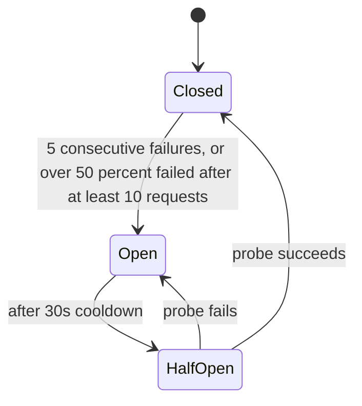

# Entity relationship

## There is no database

`warehouse-ops-agent` has **no Postgres and no schema**:

- no `migrations/` directory in the repo;
- no database driver in `go.mod` (no `pgx`, `database/sql` driver or
  similar);
- no repository port in `internal/ports`;
- `getting-started.md` and `CLAUDE.md` both state it holds no database and
  no persisted state.

So there is no ER diagram of tables, no `outbox_events`, no
`processed_events`, no `idempotency_keys`, no `schema_migrations` and no
analytics projection here. Every fact the service reasons about is
re-read from an upstream context at request time and forgotten when the
response is written. Restarting the process loses nothing.

## What state it does hold

The only state is configuration (read once at startup) and a few
process-local, in-memory structures. None of it is durable.

```mermaid
erDiagram
    CONFIG {
        string Addr "AGENT_ADDR, default :8095"
        string UpstreamMcpEndpoints "9 x _MCP_ENDPOINT, empty means skip"
        string RestBaseUrls "4 OLTP + 7 reports base URLs"
        duration CapacityOutlookHorizon "default 8h"
        string PrometheusURL "empty means stub reader"
        string LokiURL "empty means loki unavailable"
        string RuntimeSignalsNamespace "default warehouse-systems"
        string RuntimeSignalsServices "default 8 backend contexts"
    }
    PATH_TARGET {
        string SiteCode "facility-layout site, also warehouse-planning location"
        string PathId "wes-work-planning path id"
        string ProcessPath "fulfillment-execution queue PICK PACK SLAM"
        string BuildingId "workforce-management key"
        string ShiftId "workforce-management key"
        string PlanningPathId "optional, warehouse-planning path id"
        float UnitsPerOrder "optional, never defaulted"
        float PackagesPerOrder "optional, never defaulted"
    }
    LLM_CONFIG {
        string Mode "off shadow on, unknown is a startup error"
        string APIKey "ANTHROPIC_API_KEY, never logged"
        string Model "default claude-sonnet-4-5"
        duration Timeout "default 8s"
        string ToolAllowList "upstream slash tool entries"
    }
    TOOL_SPEC_CACHE {
        string Upstream "mcpclient session name"
        string Name "allow-listed tool"
        string Description "verbatim from upstream tools/list"
        json InputSchema "verbatim from upstream tools/list"
    }
    CIRCUIT_BREAKER {
        string Dependency "anthropic-llm"
        int State "0 closed, 1 half-open, 2 open"
        int ConsecutiveFailures "trips at 5"
        int Requests "rolling window, reset every 30s"
    }
```

Source: `internal/config/config.go` (`Config`, `PathTarget`, `LLMConfig`,
defaults), `internal/adapters/outbound/mcpclient/tool_invoker.go`
(`ToolInvoker.specs`), `internal/resilience/breaker.go` and
`internal/adapters/outbound/llm/anthropic/reasoner.go` (the one
`gobreaker` instance).
Omits: OTel metric instruments and the per-call MCP client session, which
`Session.callTool` opens and closes on every call.

No relationship lines are drawn: there are no foreign keys anywhere. The
logical links are prose-only:

- `CONFIG` holds a list of `PATH_TARGET` entries (`DAILY_BRIEF_PATH_TARGETS`,
  a JSON array; one default target `WH1` / `pick-zone-a` / `PICK` /
  `wh1` / `shift-1` when unset; a set but unparseable value is a startup
  error, not a silent fallback) and one `LLM_CONFIG`.
- `TOOL_SPEC_CACHE` is filled once per process by `ToolInvoker.Specs`, and
  only when `LLM_MODE` is not `off`.
- `CIRCUIT_BREAKER` exists only when the Anthropic reasoner is wired.

## The circuit breaker is the only state machine

Source: `internal/resilience/breaker.go` (`ReadyToTrip`,
`DefaultMaxRequests = 1`, `DefaultInterval = 30s`, `DefaultCooldown = 30s`).
Omits: the retry with jittered backoff around each call (ADR 0011) and the
`circuit_breaker_state{dependency="anthropic-llm"}` gauge it publishes.

## Table ≠ aggregate mapping

| Table | Aggregate | Notes |
|---|---|---|
| none | none | No table and no aggregate exist. Upstream contexts own every persisted fact this service reads; see the [context map](../ecosystem/context-map.md) for whose. |
