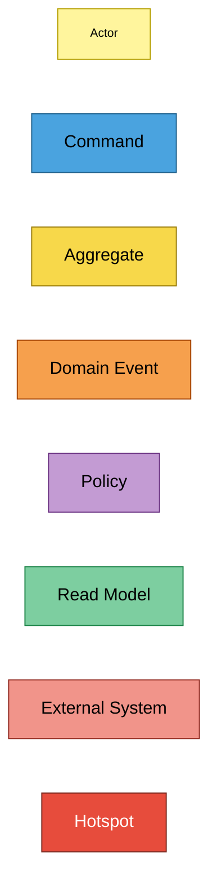
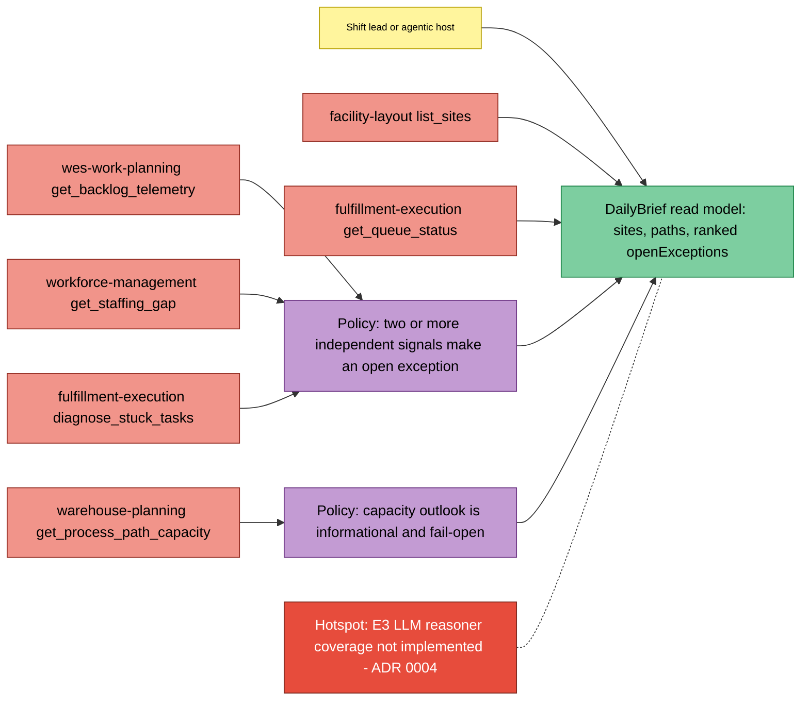
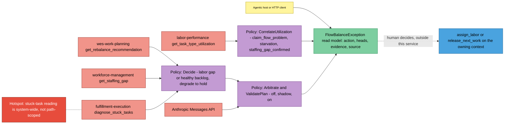
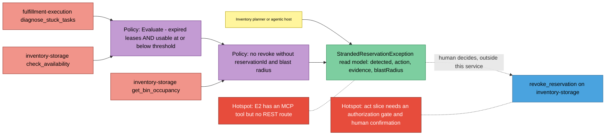

# EventStorming

Design-level boards in the notation of the ddd-crew
[EventStorming glossary / cheat sheet](https://github.com/ddd-crew/eventstorming-glossary-cheat-sheet).

:::note[No orange stickies]
This service emits and consumes **no domain events** and handles **no
commands** — every inbound message is a query, and there is no Kafka I/O
(see [Domain events](./domain-events.md)). The boards therefore show the
read side: actors, the external systems whose facts are read, the policies
(correlation rules) that combine them, the read models handed back, and
hotspots. The only blue command sticky is the write a *human* may perform
afterwards on another context's own tool; it is drawn outside this service
on purpose.
:::

## Legend

Aggregate and Domain Event appear in the legend only: no sticky of either
kind exists on these boards (see [Aggregate design canvas](./aggregate-design-canvas.md)).

## Board 1: daily brief (E3)

Source: `internal/application/usecases/dailybrief.go`,
`internal/domain/policy/dailybrief.go`,
`internal/domain/policy/capacity_outlook.go`, ADR 0004 Status line.
Omits: the per-path loop and the `Unavailable` bookkeeping.

## Board 2: flow-balance exception (E1) with overlays

Source: `internal/application/usecases/flow_balance_advisory.go`,
`internal/domain/policy/flow_balance.go`,
`internal/domain/policy/utilization_correlation.go`,
`internal/domain/policy/arbitrate.go`.
Omits: the explain-travel-factor advisory (ADR 0009), which is a separate
request, not part of this decision.

## Board 3: stranded reservation (E2)

Source: `internal/application/usecases/stranded_reservation.go`,
`internal/domain/policy/stranded_reservation.go`,
`docs/docs/mcp/governance-note.md`, `docs/docs/api-surface.md`.
Omits: the per-branch evidence lines.

## Sticky inventory

| Sticky | Kind | Code evidence |
|---|---|---|
| Shift lead / agentic host / HTTP client / planner | Actor | callers of `internal/adapters/inbound/{http,mcp}` |
| `list_sites`, `get_backlog_telemetry`, `get_rebalance_recommendation`, `get_staffing_gap`, `get_queue_status`, `diagnose_stuck_tasks`, `get_task_type_utilization`, `check_availability`, `get_bin_occupancy`, `get_process_path_capacity` | External System | `internal/adapters/outbound/mcpclient/*.go` `callTool` literals |
| Anthropic Messages API | External System | `internal/adapters/outbound/llm/anthropic/reasoner.go` |
| Two-or-more-signals rule | Policy | `policy.deriveExceptions` |
| Capacity outlook fail-open | Policy | `policy.SummarizeCapacityOutlook`, `usecases.CapacityOutlook.Execute` |
| Decide | Policy | `policy.Decide`, `decideLaborGap`, `decideHealthyBacklog` |
| CorrelateUtilization | Policy | `policy.CorrelateUtilization` |
| Arbitrate / ValidatePlan | Policy | `policy.Arbitrate`, `policy.ValidatePlan` |
| Evaluate / blast-radius rule | Policy | `policy.Evaluate`, `holdException`, `revokeException` |
| DailyBrief, FlowBalanceException, StrandedReservationException | Read Model | `policy.DailyBrief`, `policy.Decision`, `policy.StrandedReservationException` |
| `assign_labor`, `release_next_work`, `revoke_reservation` | Command (on another context, by a human) | named in `policy.RecommendedAction` / `policy.StrandedReservationAction`; no client method exists (`zerowrite` tests) |
| E3 reasoner not implemented | Hotspot | ADR 0004 Status |
| Stuck-task reading not path-scoped | Hotspot | `policy.StuckTasksSignal` doc comment |
| E2 has no REST route | Hotspot | `inbound/http/router.go` has no stranded-reservation route |
| Act slice guardrails | Hotspot | Governance note, "The future act slice" |
