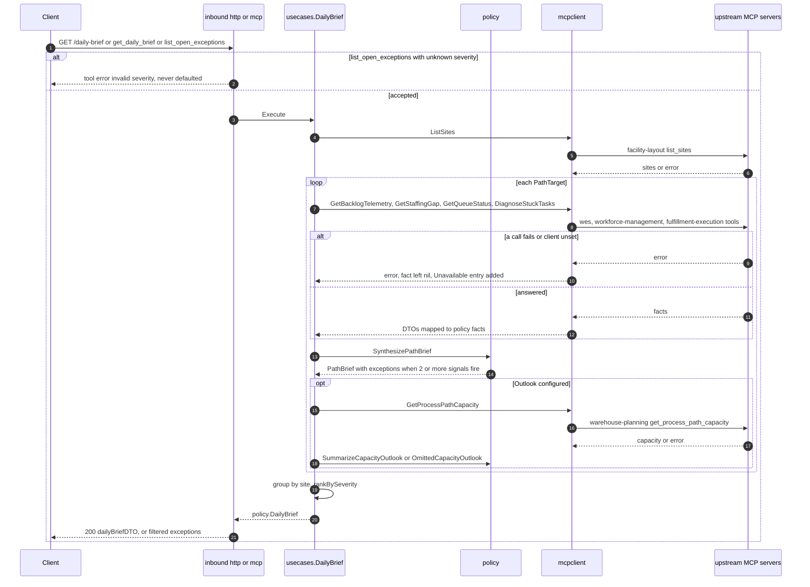
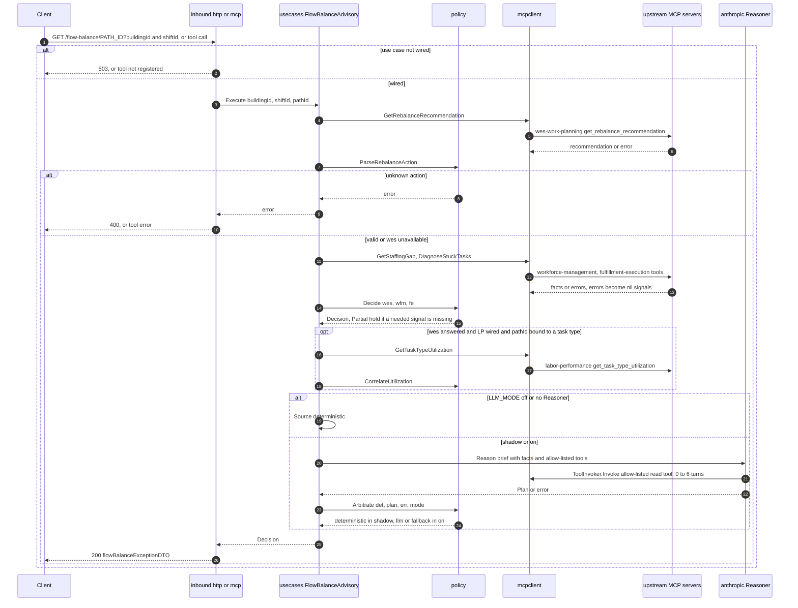
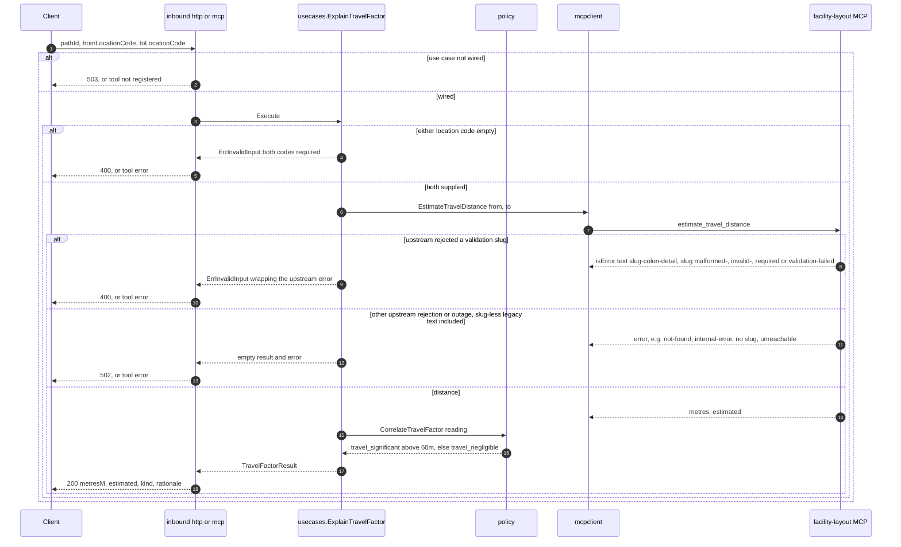
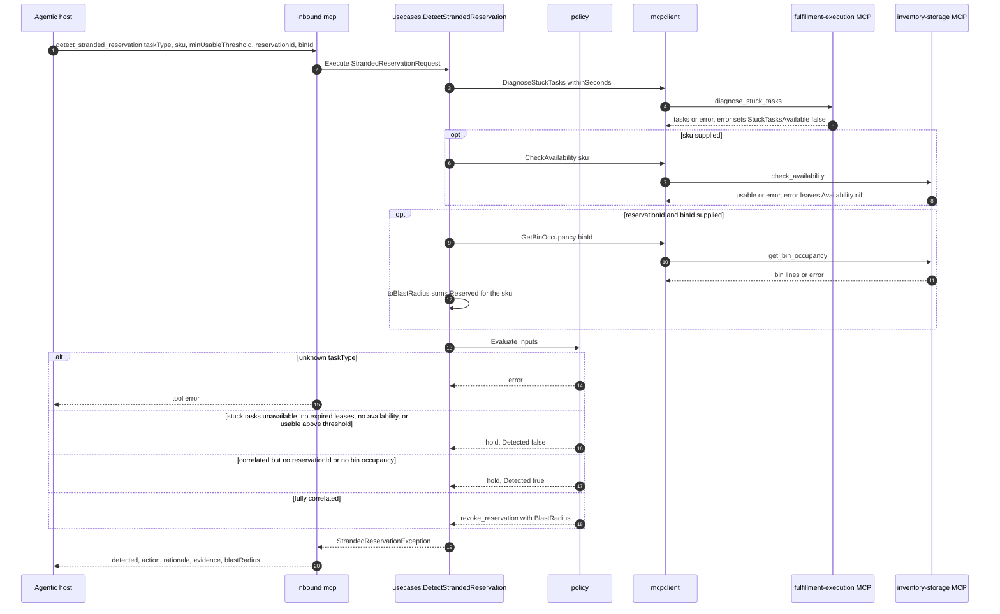
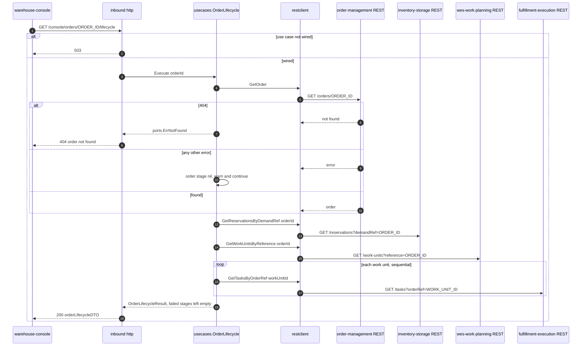
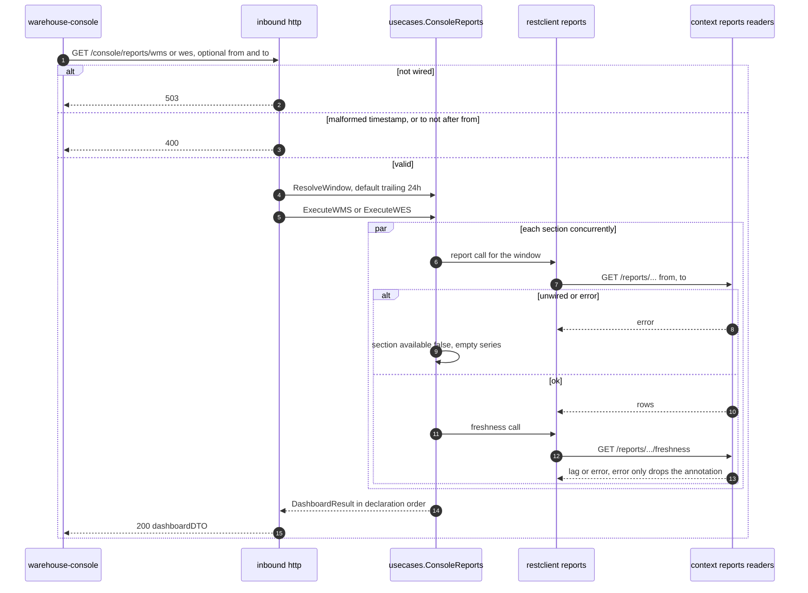
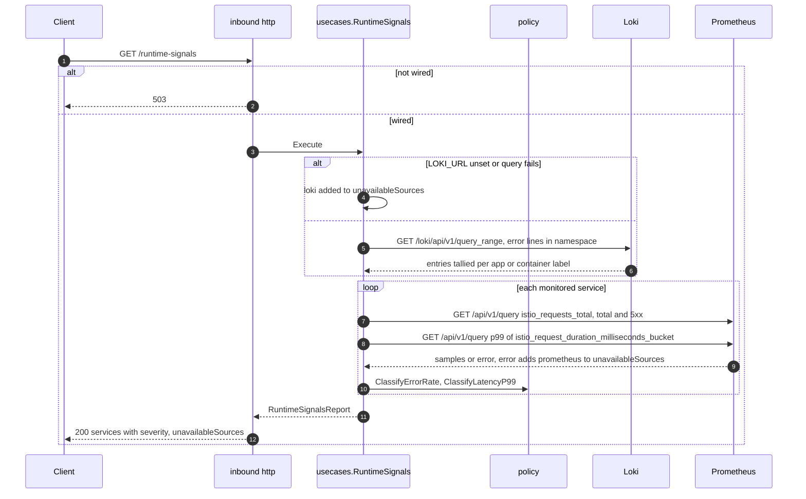

# Sequence diagrams

One diagram per inbound use case (REST and MCP share the same use case
object, so they share a diagram). Participants follow the hexagonal
layers: client, inbound adapter, use case, policy (the pure
`internal/domain/policy` function standing where an aggregate would sit in
a bounded context), outbound adapter, upstream.

:::note[What is never on these diagrams]
No repository, no transaction, no outbox, no idempotency middleware and no
optimistic-concurrency version check: this service has no database and
handles no command. Every use case is a read fan-out followed by a pure
policy call.
:::

## Daily brief — `GET /daily-brief`, `get_daily_brief`, `list_open_exceptions`

Source: `internal/application/usecases/dailybrief.go`,
`internal/application/usecases/capacity_outlook.go`,
`internal/adapters/inbound/http/router.go` (`getDailyBrief`),
`internal/adapters/inbound/mcp/tools.go` (`getDailyBrief`,
`listOpenExceptions`, `severityRank`).
Omits: that `list_sites` failure only leaves site names empty, and the
per-path stuck-task filter `countForPath`.

## Flow-balance exception — `GET /flow-balance/{pathId}`, `get_flow_balance_exception`

Source: `internal/application/usecases/flow_balance_advisory.go`,
`internal/domain/policy/{flow_balance,arbitrate,utilization_correlation}.go`,
`internal/adapters/outbound/llm/anthropic/reasoner.go`,
`internal/adapters/outbound/mcpclient/tool_invoker.go`.
Omits: the circuit breaker, timeout and retry around each Anthropic call
(ADR 0011), the `llm.tool_call` audit log, and the arbitration metrics.

## Explain travel factor — `GET /explain-travel-factor`, `explain_travel_factor`

Source: `internal/application/usecases/explain_travel_factor.go`,
`internal/domain/policy/travel_factor.go`,
`internal/adapters/outbound/mcpclient/tool_error.go`,
`internal/adapters/inbound/http/router.go` (`getExplainTravelFactor`).
Decided 2026-10-06 ([ADR 0018](../adr/0018-mcp-tool-error-slug-classification.md)):
the upstream's tool-error text is `<slug>: <detail>` (fleet convention); only
the explicit validation slugs (`malformed-*`, `invalid-*`, `*-required`,
`validation-failed`, `missing-location-code`) are classified as invalid input
(400). Not-found, `internal-error`, any other slug and slug-less text from an
older facility-layout stay 502.
Omits: the use case's nil-`Facility` branch, which returns an empty result
with no error.

## Stranded reservation — `detect_stranded_reservation` (MCP only)

Source: `internal/application/usecases/stranded_reservation.go`,
`internal/domain/policy/stranded_reservation.go`,
`internal/adapters/inbound/mcp/tools.go` (`detectStrandedReservation`).
Omits: the evidence line appended on each branch. No REST route exists for
this use case.

## Order lifecycle — `GET /console/orders/{id}/lifecycle`

Source: `internal/application/usecases/order_lifecycle.go`,
`internal/adapters/outbound/restclient/clients.go`,
`internal/adapters/inbound/http/router.go` (`getOrderLifecycle`).
Omits: the DTO mapping (`packageSealed` / `labelApplied` are derived from a
completed `SLAM` task).

Decided 2026-10-06: kept — an unreachable order-management leaves the
order-management stage `null` in a 200 (ADR 0002 degrade-to-null; only a 404
fails the request). The agent is an advisory read-side aggregator; one
dependency outage must not fail the whole view.

## WMS / WES dashboards — `GET /console/reports/wms`, `GET /console/reports/wes`

Source: `internal/application/usecases/console_reports.go`,
`internal/application/usecases/console_reports_{wms,wes}.go`,
`internal/adapters/outbound/restclient/reports_clients.go`,
`internal/adapters/inbound/http/router.go` (`serveDashboard`).
Omits: the per-section series aggregation. WMS has 3 sections
(order-management, inventory-storage, facility-layout); WES has 4
(wes-work-planning, fulfillment-execution, workforce-management,
labor-performance).

## Runtime signals — `GET /runtime-signals`

Source: `internal/application/usecases/runtime_signals.go`,
`internal/domain/policy/runtime_signals.go`,
`internal/adapters/outbound/telemetry/prometheus_reader.go`,
`internal/adapters/outbound/logs/loki_reader.go`.
Omits: the stub reader used when `PROMETHEUS_URL` is unset (all metrics
read as zero, `normal`), and `ServiceSignal.Severity` lifting any service
with recent error logs to at least `warning`.
