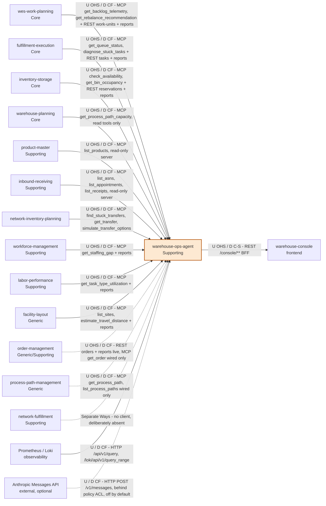

# Context map

This is `warehouse-ops-agent`'s slice of the fleet context map, in
ddd-crew [Context Mapping](https://github.com/ddd-crew/context-mapping)
notation. It is part of the [DDD artifact pack](../ddd/ddd-artifacts.md).

`warehouse-ops-agent` carries **three distinct relationships** to the rest
of the fleet, added in different phases and never merged into one:

1. **MCP Customer** (ADR 0001, extended by
   [ADR 0007](../adr/0007-second-wave-outbound-mcp-clients.md)) — the
   daily-brief, flow-balance-exception, explain-travel-factor and
   stranded-reservation use cases read each context's published MCP Open
   Host Service, synchronously, at request time. Clients exist for eleven
   contexts: the five original ones plus `labor-performance` (consumed by
   the [ADR 0008](../adr/0008-labor-utilization-advisory-correlation.md)
   utilization overlay), `order-management` and `process-path-management`
   (wired, not yet consumed by any use case), and `warehouse-planning`
   ([ADR 0013](../adr/0013-warehouse-planning-mcp-client-and-capacity-outlook.md):
   read tools only; `get_process_path_capacity` feeds the daily brief's
   optional capacity outlook, the other three read tools are wired but
   unconsumed), `product-master`
   ([ADR 0020](../adr/0020-product-master-mcp-client-and-master-data-gaps.md):
   read-only server; `list_products` feeds the master-data gaps report, the
   other three read tools are wired but unconsumed; deployed and switched on
   in the kind cluster), `inbound-receiving`
   ([ADR 0021](../adr/0021-inbound-receiving-mcp-client-and-inbound-outlook.md):
   read-only server; `list_asns`, `list_appointments` and `list_receipts` feed
   the inbound outlook, the other four read tools are wired but unconsumed;
   off until `INBOUND_RECEIVING_MCP_ENDPOINT` is set) and `network-inventory-planning`
   ([ADR 0019](../adr/0019-network-inventory-planning-transfer-watch.md):
   read tools only; they feed the transfer watch).
2. **REST fan-out host for `console-bff`** ([ADR
   0002](../adr/0002-micro-frontend-console-architecture.md), [ADR
   0003](../adr/0003-console-bff-report-dashboards.md)) — a *separate*
   driving use case on behalf of the `warehouse-console` browser SPA:
   `GET /console/orders/{id}/lifecycle` calls four contexts' OLTP REST APIs
   (`order-management`, `inventory-storage`, `wes-work-planning`,
   `fulfillment-execution`), and `GET /console/reports/wms` / `/wes` call
   seven contexts' separate `*-reports` analytics binaries.
3. **Telemetry reader** — `GET /runtime-signals` queries the fleet's
   Prometheus (Istio request metrics) and Loki (error log lines) directly;
   neither is a bounded context.

The first two are deliberately kept as separate outbound adapter families
(`internal/adapters/outbound/mcpclient/` and
`internal/adapters/outbound/restclient/`) rather than unified, because
they answer different questions for different callers: an LLM host
asking "what needs attention right now" versus a browser rendering "what
happened to order X" for a human.

Source: `cmd/agent/main.go`, `cmd/agent/reasoner.go`,
`internal/adapters/outbound/{mcpclient,restclient,telemetry,logs,llm/anthropic}/*.go`,
`internal/adapters/inbound/http/router.go`, `internal/config/config.go`.
Omits: the tool-by-tool list for wired-but-unconsumed tools (see the
table), the `/freshness` calls that accompany every report call, and
relationships between the other contexts.

Arrows point from upstream (U) to downstream (D), i.e. in the direction
facts flow; every *call* goes the other way, from this agent outward. A
solid arrow is live; a dashed arrow is wired-but-unconsumed, or (for the
LLM) off unless `LLM_MODE` is set; the undirected dashed link to
`network-fulfillment` marks a deliberate absence. Every edge is a read — nothing here ever gains write access to any
context.

## Relationship table

| Upstream | Pattern | Technology | Status | Evidence |
|---|---|---|---|---|
| `wes-work-planning` (Core) | OHS / Conformist | MCP `get_backlog_telemetry`, `get_rebalance_recommendation`; REST `GET /work-units?reference=`; reports `/reports/throughput` | live | `mcpclient/wes_work_planning.go`, `restclient/clients.go`, `restclient/reports_clients.go` |
| `fulfillment-execution` (Core) | OHS / Conformist | MCP `get_queue_status`, `diagnose_stuck_tasks` (live), `find_claimable_work` (wired); REST `GET /tasks?orderRef=` (joined via each WorkUnit's id, not the plain order id — see ADR 0002); reports `/reports/throughput` | live | `mcpclient/fulfillment_execution.go`, `restclient/clients.go` |
| `inventory-storage` (Core) | OHS / Conformist | MCP `check_availability`, `get_bin_occupancy` (E2, exposed as the MCP tool `detect_stranded_reservation`); REST `GET /reservations?demandRef=`; reports `/reports/flow-accuracy` | live | `mcpclient/inventory_storage.go`, `usecases/stranded_reservation.go` |
| `warehouse-planning` (Core) | OHS / Conformist, **read tools only** (its MCP server is read+write) | MCP `get_process_path_capacity` (live, daily-brief capacity outlook); `get_capacity_plan`, `get_storage_capacity`, `list_station_standards` (wired) | live, only when `WAREHOUSE_PLANNING_MCP_ENDPOINT` is set | `mcpclient/warehouse_planning.go`, `usecases/capacity_outlook.go`, `zerowrite/mcpclient_tools_test.go` |
| `product-master` (Supporting) | OHS / Conformist (read-only server; contract pinned to its published registry golden) | MCP `list_products` (live, master-data gaps); `get_product`, `get_product_classification`, `get_physical_profile` (wired) | live, only when `PRODUCT_MASTER_MCP_ENDPOINT` is set (warehouse-infra sets it in the kind cluster: `product-master-mcp:8090/mcp`) | `mcpclient/product_master.go`, `mcpclient/testdata/product_master_tools.golden.json`, `usecases/master_data_gaps.go` |
| `network-inventory-planning` | OHS / Conformist, read tools only | MCP `find_stuck_transfers`, `get_transfer`, `simulate_transfer_options` (live, transfer watch, ADR 0019); `list_transfers` (wired) | live, only when `NETWORK_INVENTORY_PLANNING_MCP_ENDPOINT` is set | `mcpclient/network_inventory_planning.go`, `usecases/transfer_watch.go` |
| `workforce-management` (Supporting) | OHS / Conformist | MCP `get_staffing_gap` (live), `propose_path_heads` (wired); reports `/reports/labor` | live | `mcpclient/workforce_management.go` |
| `labor-performance` (Supporting) | OHS / Conformist | MCP `get_task_type_utilization` (live, ADR 0008) + 3 wired tools; reports `/reports/performance` | live | `mcpclient/labor_performance.go`, `usecases/flow_balance_advisory.go` |
| `facility-layout` (Generic) | OHS / Conformist | MCP `list_sites`, `estimate_travel_distance` (live), `get_site_layout`, `get_zone_grid` (wired); reports `/reports/catalog-growth` | live | `mcpclient/facility_layout.go`, `usecases/explain_travel_factor.go` |
| `order-management` (Generic/Supporting) | OHS / Conformist | REST `GET /orders/{id}` and reports `/reports/funnel` (live); MCP `get_order` (wired, `_ = om` in `cmd/agent/main.go`) | REST live, MCP wired-but-unused | `restclient/clients.go`, `mcpclient/order_management.go` |
| `process-path-management` (Generic) | OHS / Conformist | MCP `get_process_path`, `list_process_paths` | wired-but-unused (`_ = ppm`) | `mcpclient/process_path_management.go` |
| `network-fulfillment` (Supporting) | Separate Ways | none | deliberately absent | no client in `internal/adapters/outbound` |
| Prometheus / Loki | Conformist (not a bounded context) | HTTP `/api/v1/query`, `/loki/api/v1/query_range` | live | `telemetry/prometheus_reader.go`, `logs/loki_reader.go` |
| Anthropic Messages API (external) | Conformist, with `policy.ValidatePlan` / `Arbitrate` as the anti-corruption gate | HTTP `POST /v1/messages` | off by default (`LLM_MODE=off`) | `llm/anthropic/reasoner.go`, `cmd/agent/reasoner.go` |

| Downstream | Pattern | Technology | Status | Evidence |
|---|---|---|---|---|
| `warehouse-console` | Customer/Supplier (this agent is the BFF supplier; DTOs hand-kept in sync with the console's types) | REST `/console/orders/{id}/lifecycle`, `/console/reports/wms`, `/console/reports/wes`, plus `/daily-brief` | live | `inbound/http/router.go` |
| Agentic / LLM hosts | OHS / Published Language (MCP tool schemas) | MCP `/mcp`: up to 9 read-only tools (6 in `tools.go`, 3 transfer-watch tools in `transfer_watch.go`) | live | `inbound/mcp/tools.go`, `inbound/mcp/transfer_watch.go` |

Every `*-reports` read also calls that report's `/freshness` endpoint. MCP
and REST calls carry no credentials — the fleet's auth was removed
([ADR 0006](../adr/0006-fleet-wide-auth-removal.md)).

## What is deliberately absent

This agent has **no Kafka integration** — it reads exclusively via
synchronous MCP tool calls, REST calls and Prometheus/Loki queries, at
request time. It does not subscribe to any context's domain events, and it
publishes none of its own (see [Domain events](../ddd/domain-events.md)).

It also has **no cross-repo Go dependency** on any upstream context:
`internal/architecture/architecture_test.go`'s
`TestNoDirectDependencyOnBoundedContexts` fails the build if one of the
five original contexts' modules (or `warehouse-planning`'s, or `product-master`'s) is ever
introduced, and the domain-layer types in `internal/domain/policy`
(`RebalanceAction`, `TaskType`, and so on) are hand-mirrored copies of the
upstream enums, validated at the tool-boundary rather than imported.

## Why this agent, and not one of the five contexts, owns the correlation

See [Domain vision](../business-context/domain-vision.md) and
[ADR 0001](../adr/0001-warehouse-ops-agent-placement.md): none of the
upstream contexts is the natural owner of cross-context correlation, and embedding
it in any one of them would invert that context's dependency direction
and blur its boundary.
