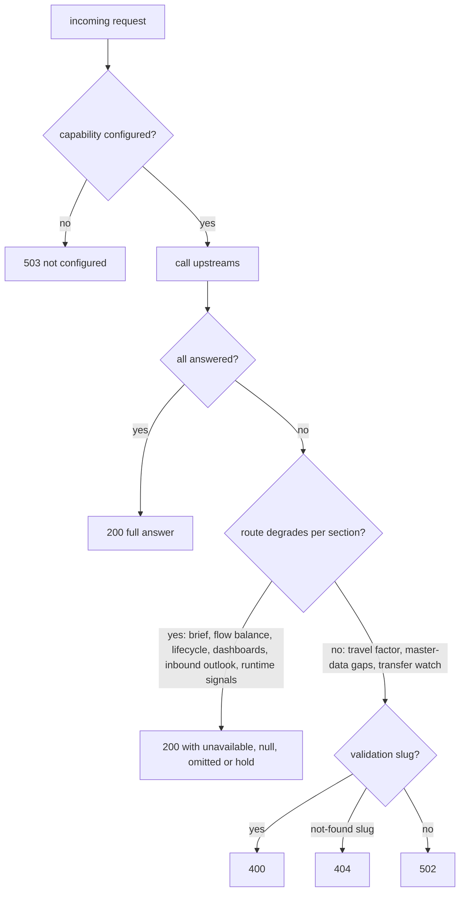

# Integration

This page is the operational view of every edge: what is called, how it
is configured, and how a failure shows up. The strategic view (context
mapping patterns, subdomain classes) is on the
[Context map](./context-map.md). Every call is a read made at request
time; the agent never writes to another context, never subscribes to an
event and publishes none.

## Transport conventions

| Protocol | Client | Timeout | Auth | Failure classification |
|---|---|---|---|---|
| MCP Streamable HTTP | `internal/adapters/outbound/mcpclient` (go-sdk v1.8.0), a fresh session per tool call, client name `warehouse-ops-agent` 0.1.0 | 10 s per call (`Session`) | none ([ADR 0006](../adr/0006-fleet-wide-auth-removal.md)) | an `isError` result whose text starts with a validation slug (`malformed-*`, `invalid-*`, `*-required`, `validation-failed`, `missing-location-code`) maps to `ErrUpstreamInvalidInput`, a `*-not-found` slug to `ErrUpstreamNotFound`, anything else is an upstream failure ([ADR 0018](../adr/0018-mcp-tool-error-slug-classification.md), `tool_error.go`) |
| REST (OLTP and `*-reports`) | `internal/adapters/outbound/restclient`, `GET` only | 5 s | none | any `404` becomes `ports.ErrNotFound` (only the order-management lookup turns it into a `404` response); any other non-2xx or transport error is a failure |
| Prometheus HTTP API | `internal/adapters/outbound/telemetry` | 5 s | none | any error marks `prometheus` unavailable |
| Loki HTTP API | `internal/adapters/outbound/logs` | 5 s | none | any error marks `loki` unavailable |
| Anthropic Messages API | `internal/adapters/outbound/llm/anthropic` | 12 s per call, 8 s per reasoning run (`LLM_TIMEOUT`) | `x-api-key` header | 5xx and transport errors retried (3 attempts), 4xx permanent, breaker per process |

No outbound call carries a `traceparent` header (no `otelhttp` transport);
see [Observability](../operations/observability.md#traces).

## Upstream MCP servers

Configured by one `*_MCP_ENDPOINT` variable each
([Configuration](../operations/configuration.md#upstream-mcp-endpoints)).
"Always built" means the client exists even with an empty endpoint and
every call then fails; "optional" means no client and the feature is off.

| Upstream | Endpoint variable | Tools called (live) | Tools wired, not called | Used by | On failure |
|---|---|---|---|---|---|
| wes-work-planning | `WES_WORK_PLANNING_MCP_ENDPOINT` (always built) | `get_backlog_telemetry`, `get_rebalance_recommendation` | none | daily brief, flow balance; LLM allow-list by default | brief: `"wes-work-planning: <error>"` in the path's `unavailable`; flow balance: `hold`, `partial: true`, missing `wes-work-planning.get_rebalance_recommendation`, no utilization overlay |
| fulfillment-execution | `FULFILLMENT_EXECUTION_MCP_ENDPOINT` (always built) | `get_queue_status`, `diagnose_stuck_tasks` | `find_claimable_work` | daily brief, flow balance, `detect_stranded_reservation`; LLM allow-list by default | brief: `unavailable` entry; flow balance: partial; stranded reservation: `hold` ("expired-lease signal is unavailable") |
| workforce-management | `WORKFORCE_MANAGEMENT_MCP_ENDPOINT` (always built) | `get_staffing_gap` | `propose_path_heads` | daily brief, flow balance; LLM allow-list by default | brief: `unavailable` entry; flow balance: partial, never guesses a labor gap |
| facility-layout | `FACILITY_LAYOUT_MCP_ENDPOINT` (always built) | `list_sites`, `estimate_travel_distance` | `get_site_layout`, `get_zone_grid` | daily brief (site names), explain-travel-factor | brief: empty `siteName`; explain-travel-factor: `502`, or `400` for a validation slug |
| inventory-storage | `INVENTORY_STORAGE_MCP_ENDPOINT` (always built) | `check_availability`, `get_bin_occupancy` | none | `detect_stranded_reservation` | `hold` with the reason in `rationale`; never a revoke recommendation on partial evidence |
| labor-performance | `LABOR_PERFORMANCE_MCP_ENDPOINT` (always built) | `get_task_type_utilization` | `get_associate_scorecard`, `get_task_type_performance`, `get_labor_standard` | flow-balance utilization overlay ([ADR 0008](../adr/0008-labor-utilization-advisory-correlation.md)) | overlay omitted; the decision is unchanged |
| order-management | `ORDER_MANAGEMENT_MCP_ENDPOINT` (always built) | none | `get_order` | nothing (`_ = om` in `cmd/agent/main.go`) | n/a |
| process-path-management | `PROCESS_PATH_MANAGEMENT_MCP_ENDPOINT` (always built) | none | `get_process_path`, `list_process_paths` | nothing (`_ = ppm`) | n/a |
| warehouse-planning | `WAREHOUSE_PLANNING_MCP_ENDPOINT` (optional) | `get_process_path_capacity` | `get_capacity_plan`, `get_storage_capacity`, `list_station_standards` | daily-brief `capacityOutlook` ([ADR 0013](../adr/0013-warehouse-planning-mcp-client-and-capacity-outlook.md)) | the path's `capacityOutlook` carries an `omittedReason`; the brief is still `200` |
| product-master | `PRODUCT_MASTER_MCP_ENDPOINT` (optional) | `list_products` | `get_product`, `get_product_classification`, `get_physical_profile` | `GET /master-data-gaps`, `find_master_data_gaps` ([ADR 0020](../adr/0020-product-master-mcp-client-and-master-data-gaps.md)) | `502`, no partial report; `400` for a rejected cursor |
| inbound-receiving | `INBOUND_RECEIVING_MCP_ENDPOINT` (optional) | `list_asns`, `list_appointments`, `list_receipts` | `get_asn`, `get_appointment`, `get_receipt`, `list_docks` | `GET /inbound-outlook`, `get_inbound_outlook` ([ADR 0021](../adr/0021-inbound-receiving-mcp-client-and-inbound-outlook.md)) | the failing section is `omitted` with a reason; `502` only when every attempted section failed |
| network-inventory-planning | `NETWORK_INVENTORY_PLANNING_MCP_ENDPOINT` (optional) | `find_stuck_transfers`, `get_transfer`, `simulate_transfer_options` | `list_transfers` | `/transfer-watch/*` and the three transfer-watch tools ([ADR 0019](../adr/0019-network-inventory-planning-transfer-watch.md)) | `502`; `404` for `*-not-found`; `400` for a validation slug; the imbalance fails closed until NIP's read models are fresh |

The zero-write tests (`internal/architecture/zerowrite`) fail the build if
any client calls a tool outside the read set, and pin product-master's and
inbound-receiving's clients to exactly the tools above.

### Tools the LLM may call

When `LLM_MODE` is `shadow` or `on`, the reasoner can call the MCP tools
on `LLM_TOOL_ALLOWLIST` through the same clients (`ToolInvoker`). Only
five upstreams have a reasoner session: wes-work-planning,
fulfillment-execution, workforce-management, inventory-storage and
facility-layout (`cmd/agent/reasoner.go`). The default list is
`wes-work-planning/get_backlog_telemetry`,
`wes-work-planning/get_rebalance_recommendation`,
`workforce-management/get_staffing_gap`,
`fulfillment-execution/get_queue_status` and
`fulfillment-execution/diagnose_stuck_tasks`. Arguments are validated
against each tool's discovered schema before the call; a refused call
never reaches the upstream.

## Upstream REST APIs (console-bff)

Base URLs default to `localhost` ports and are overridden in the cluster
([Configuration](../operations/configuration.md#console-bff-rest-base-urls)).

| Upstream | Variable | Request | Used by | On failure |
|---|---|---|---|---|
| order-management (OLTP) | `ORDER_MANAGEMENT_REST_URL` | `GET /orders/<id>` | `GET /console/orders/{id}/lifecycle` | `404` passes through as `404`; anything else nulls `orderManagement` |
| inventory-storage (OLTP) | `INVENTORY_STORAGE_REST_URL` | `GET /reservations?demandRef=<id>` | order lifecycle | `inventory: null` |
| wes-work-planning (OLTP) | `WES_WORK_PLANNING_REST_URL` | `GET /work-units?reference=<id>` | order lifecycle | `planning: null`, and no task lookup follows |
| fulfillment-execution (OLTP) | `FULFILLMENT_EXECUTION_REST_URL` | `GET /tasks?orderRef=<workUnitId>` per work unit | order lifecycle | `fulfillment: null` |
| order-management-reports | `ORDER_MANAGEMENT_REPORTS_REST_URL` | `GET /reports/funnel`, `/reports/funnel/freshness` | WMS dashboard `order-funnel` | section `available: false`; a failed freshness call only nulls `freshnessLagSeconds` |
| inventory-storage-reports | `INVENTORY_STORAGE_REPORTS_REST_URL` | `GET /reports/flow-accuracy` (+ `/freshness`) | WMS `inventory-flow-accuracy` | same |
| facility-layout-reports | `FACILITY_LAYOUT_REPORTS_REST_URL` | `GET /reports/catalog-growth` (+ `/freshness`) | WMS `catalog-growth` | same |
| wes-work-planning-reports | `WES_WORK_PLANNING_REPORTS_REST_URL` | `GET /reports/throughput` (+ `/freshness`) | WES `planning-throughput` | same |
| fulfillment-execution-reports | `FULFILLMENT_EXECUTION_REPORTS_REST_URL` | `GET /reports/throughput` (+ `/freshness`) | WES `fulfillment-throughput` | same |
| workforce-management-reports | `WORKFORCE_MANAGEMENT_REPORTS_REST_URL` | `GET /reports/labor` (+ `/freshness`) | WES `labor-management` | same |
| labor-performance-reports | `LABOR_PERFORMANCE_REPORTS_REST_URL` | `GET /reports/performance` (+ `/freshness`) | WES `labor-performance` | same |

Every report call carries `from` and `to` as UTC RFC3339. The sections of
one dashboard run concurrently, so one slow reader delays only its own
section, up to the 5 s timeout.

## Observability backends

| Upstream | Variable | Query | Used by | On failure or when unset |
|---|---|---|---|---|
| Prometheus | `PROMETHEUS_URL` | `GET /api/v1/query` with `istio_requests_total` and `istio_request_duration_milliseconds_bucket` over 10 minutes, per service in `RUNTIME_SIGNALS_SERVICES` | `GET /runtime-signals` | unset: stub reader, every metric `0`; failure: `prometheus` in `unavailableSources` |
| Loki | `LOKI_URL` | `GET /loki/api/v1/query_range` for `{namespace="<RUNTIME_SIGNALS_NAMESPACE>"}` lines matching error or fatal, 50 lines over 600 s | `GET /runtime-signals` | `loki` in `unavailableSources` |
| OTel Collector | `OTEL_EXPORTER_OTLP_ENDPOINT` | OTLP/gRPC push of traces and metrics | all | telemetry dropped, `opentelemetry error` logged; requests unaffected |

## External: Anthropic Messages API

| Item | Value |
|---|---|
| Endpoint | `POST <LLM_BASE_URL or https://api.anthropic.com>/v1/messages`, API version header `2023-06-01` |
| Model | `LLM_MODEL`, default `claude-sonnet-4-5` |
| When | only `GET /flow-balance/{pathId}` and `get_flow_balance_exception`, only when `LLM_MODE` is `shadow` or `on` ([ADR 0004](../adr/0004-llm-reasoner-behind-the-policy-layer.md)) |
| Contract | the model must answer through the `submit_plan` tool (`recommendedAction` from the closed set, `proposedHeads` 0–50, `rationale`); `policy.ValidatePlan` rejects anything else |
| On failure | `shadow`: invisible to the caller; `on`: `source: fallback` with the deterministic decision. Breaker opens after 5 consecutive failures or more than 50 % of at least 10 requests in 30 s, stays open 30 s ([ADR 0011](../adr/0011-reasoner-path-circuit-breaker-timeout-retry.md)) |

## Downstream callers

| Caller | Protocol | Contract | Notes |
|---|---|---|---|
| warehouse-console (browser) | REST over Kong (`/api/warehouse-ops-agent`) or `http://localhost:8096` in dev | `GET /daily-brief` (Floor screen, polled every 15 s), `GET /console/orders/{id}/lifecycle` (Order Lifecycle screen), `GET /console/reports/wms` and `/wes` (report dashboards) | DTOs are kept in sync by hand with the console's `types.ts` files; CORS must allow the console origin (`CORS_ALLOWED_ORIGINS`) |
| MCP hosts and LLM agents | MCP Streamable HTTP at `/mcp`, stateless | up to ten read-only tools ([MCP tools](../mcp/tools.md)) | errors are plain messages, not ADR 0018 slugs |
| Operators | REST | every route on [HTTP routes](../api/http-routes.md) | no auth |

## Edges that do not exist

| Edge | Status | Why |
|---|---|---|
| Kafka (any topic, produce or consume) | absent | the agent reads at request time only; it has no Kafka client and publishes no CloudEvents ([Domain events](../ddd/domain-events.md)) |
| network-fulfillment | absent | no client in `internal/adapters/outbound`; Separate Ways on the [Context map](./context-map.md) |
| slotting-optimization | absent | no client |
| Any write call to a sibling | forbidden | zero-write tests; `detect_stranded_reservation` recommends `revoke_reservation` but never calls it |
| A Go import of a sibling module | forbidden | `TestNoDirectDependencyOnBoundedContexts` |
| Postgres or any other store | absent | the agent is stateless |

## Failure behaviour in one picture

Source: `internal/adapters/inbound/http/router.go`,
`internal/adapters/inbound/http/{master_data_gaps,inbound_outlook,transfer_watch}.go`,
`internal/adapters/outbound/mcpclient/tool_error.go`. Simplification:
inbound outlook returns `502` when every attempted section failed, and
only the transfer-status route maps `*-not-found` to `404`.
