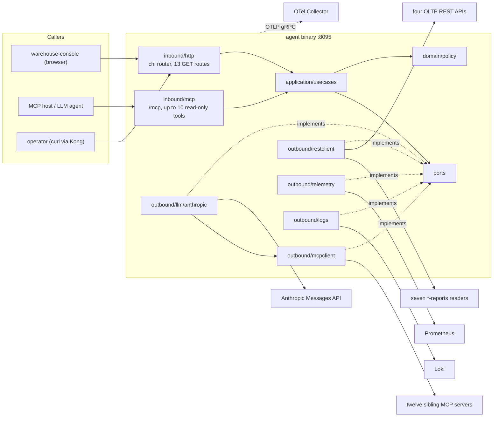
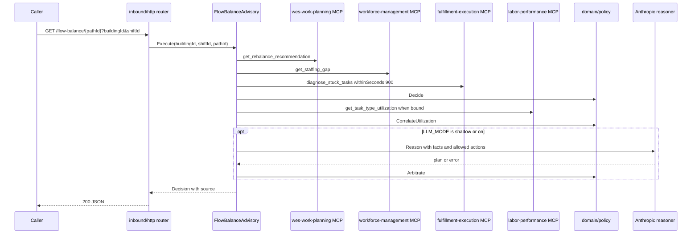

# Architecture

warehouse-ops-agent is a read-only decision-support aggregator, not a
bounded context: it owns no aggregate and persists nothing
([ADR 0001](../adr/0001-warehouse-ops-agent-placement.md)). Its code
still follows the fleet's hexagonal layout, with one difference: the
"domain" is decision **policy** (pure correlation rules over facts read
from other contexts) instead of aggregates.

## Binaries and ports

| Binary | Role | Listens on | Source |
|---|---|---|---|
| `agent` | the only binary. Serves every REST route and the agent's own MCP server (`/mcp`, Streamable HTTP, stateless) from one chi router | `AGENT_ADDR`, default `:8095` | `cmd/agent/main.go`, `cmd/agent/reasoner.go` |

There is no separate `cmd/mcp`, no `*-reports` reader and no projector.
In the Helm chart one Deployment runs the binary behind a Service on port
`80` ([Runbook](../operations/runbook.md)).

## Package layout

| Package | Layer | Contents |
|---|---|---|
| `internal/domain/policy` | domain | pure functions and value types: `Decide` (flow balance, E1), `Evaluate` (stranded reservation, E2), daily-brief exception derivation (E3), travel-factor classification, utilization correlation, capacity outlook, master-data gaps, inbound outlook, transfer triage and imbalance, runtime-signal thresholds, `ValidatePlan` and `Arbitrate` for the LLM plan. No I/O, no struct tags. |
| `internal/application/usecases` | application | one struct per use case (see [Use cases](../ddd/use-cases.md)); each gathers facts through ports, degrades on a missing signal, and calls the policy |
| `internal/ports` | ports | the interfaces the use cases depend on: one client interface per upstream context (`clients.go`, `clients_phase2.go`, `clients_planning.go`, `clients_product_master.go`, `clients_inbound_receiving.go`, `clients_nip.go`), the console REST clients (`order_lifecycle_clients.go`, `console_reports_clients.go`), `TelemetryReader`, `LogReader`, `Reasoner`, `ToolInvoker`, `ArbitrationMetrics`, and the sentinel errors `ErrNotFound`, `ErrUpstreamInvalidInput`, `ErrUpstreamNotFound` |
| `internal/adapters/inbound/http` | driving adapter | chi router, middleware chain, handlers and JSON DTOs for the 13 `GET` routes; mounts `/mcp` |
| `internal/adapters/inbound/mcp` | driving adapter | the agent's MCP server (`warehouse-ops-agent-mcp` 1.0.0) and its up to ten read-only tools |
| `internal/adapters/outbound/mcpclient` | driven adapter | one typed client per upstream MCP server (twelve), the shared `Session` (fresh Streamable HTTP session per call, 10 s timeout), the ADR 0018 tool-error slug classifier, and the `ToolInvoker` the LLM uses |
| `internal/adapters/outbound/restclient` | driven adapter | plain REST clients for the four OLTP APIs and the seven `*-reports` readers (5 s timeout) |
| `internal/adapters/outbound/telemetry` | driven adapter | the Prometheus reader (or a no-op stub), and the OTel `ArbitrationMetrics` and `CircuitBreakerMetrics` |
| `internal/adapters/outbound/logs` | driven adapter | the Loki reader |
| `internal/adapters/outbound/llm/anthropic` | driven adapter | the Anthropic Messages API `Reasoner`: tool-use loop, `submit_plan`, tool-argument validation, breaker, retry |
| `internal/resilience` | shared | breaker trip condition (`ReadyToTrip`), state recorder contract, call-timeout helper |
| `internal/observability` | shared | OTel setup and the trace-id slog handler |
| `internal/config` | composition | `config.Load()` from environment variables |
| `cmd/agent` | composition root | builds every adapter and use case, wires the reasoner by `LLM_MODE`, serves |

## Component diagram

Source: `cmd/agent/main.go`, `cmd/agent/reasoner.go`,
`internal/adapters/inbound/http/router.go`,
`internal/adapters/inbound/mcp/server.go`, `internal/ports/*.go`.
The `LLM --> MCPC` edge is the `ToolInvoker`: the model's only actuators
are read tools on the allow-list, called through the same MCP sessions.

## Dependency rules

`internal/architecture/architecture_test.go` (arch-go) and
`fitness_test.go` enforce:

| Rule | Test |
|---|---|
| `domain` depends on nothing internal except itself | `TestHexagonalDependencyRules` |
| `application` depends only on `domain` and `ports` | `TestHexagonalDependencyRules` |
| `ports` depend on nothing internal | `TestHexagonalDependencyRules` |
| inbound adapters never import outbound adapters, and the reverse | `TestHexagonalDependencyRules` |
| only `cmd` wires every layer together | `TestHexagonalDependencyRules` |
| the MCP inbound adapter depends only on application, domain and ports, and nothing else imports it | `TestMCPAdapterDependencyRule` |
| no module of a sibling context is ever a Go dependency (fulfillment-execution, wes-work-planning, workforce-management, inventory-storage, facility-layout, warehouse-planning, product-master, inbound-receiving) | `TestNoDirectDependencyOnBoundedContexts` |
| no auth middleware comes back ([ADR 0006](../adr/0006-fleet-wide-auth-removal.md)) | `TestNoAuthMiddlewareReintroduced` |
| no `json:` or `db:` struct tags in the domain | `TestNoStructTagsInDomain` |
| no write: no mutating HTTP method in outbound clients, only read MCP tools called, every served tool `ReadOnlyHint` | `internal/architecture/zerowrite` |

The config-to-use-case mapping (`toUseCaseTargets`, `toPathTaskTypes` in
`cmd/agent/main.go`) exists so that `internal/application` never imports
`internal/config`.

## Data stores

None. The agent has no database, no cache, no queue and no file it
writes. Everything it returns is recomputed per request from:

- the sibling contexts' MCP servers (synchronous `tools/call`),
- the OLTP REST APIs and `*-reports` readers (synchronous `GET`),
- Prometheus (`/api/v1/query`) and Loki (`/loki/api/v1/query_range`),
- optionally the Anthropic Messages API (`POST /v1/messages`).

The only in-process state is the circuit breaker's counters and the
reasoner's list of discovered tool schemas, both rebuilt on restart.

## Request flow: flow-balance exception

Source: `internal/application/usecases/flow_balance_advisory.go`,
`internal/domain/policy/arbitrate.go`.

## Related pages

- [Use cases](../ddd/use-cases.md)
- [Integration](../ecosystem/integration.md)
- [HTTP routes](../api/http-routes.md) and [MCP tools](../mcp/tools.md)
- [Configuration](../operations/configuration.md)
